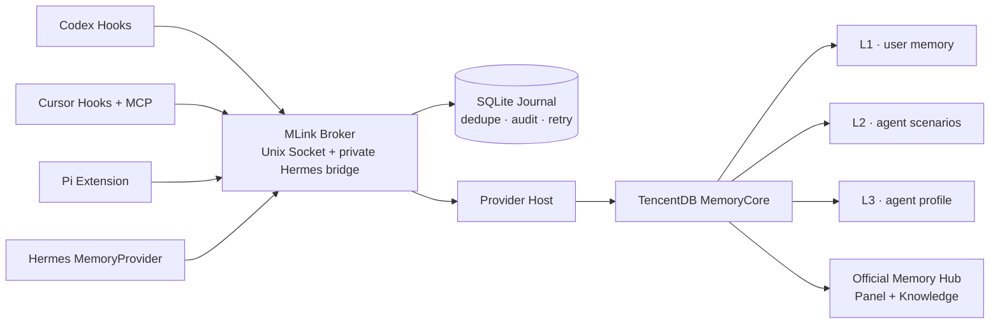

<div align="center">


[English](README.md) · [简体中文](README.zh-CN.md)

Connect Codex, Cursor, Pi, and Hermes Agent to one local memory service—without replacing their model provider, subscription, API key, or authentication flow.

[](https://go.dev/)
[](#what-mlink-does-not-touch)
[](#architecture)

</div>

## Why MLink

Every coding agent has its own lifecycle, configuration, and memory surface. MLink gives them a shared memory plane while preserving those boundaries:

- **Codex** — lifecycle Hooks for recall and capture.
- **Cursor Desktop / CLI** — fail-open Hooks for capture and stdio MCP for query-specific recall.
- **Pi** — native Extension integration.
- **Hermes Agent** — MemoryProvider bridge with Feishu DM, group, and topic routing.
- **TencentDB MemoryCore** — the first production Provider, including the official Memory Hub Panel.

MLink is not an LLM proxy. Your agent continues using the model account and provider it already had.

## What MLink actually solves

TencentDB Agent Memory already provides a multi-user and team-aware memory foundation: Users and User Keys, Teams and memberships, Agents and Tasks, asset ownership and ACLs, plus the L0–L3 memory engine. MLink does not replace or reimplement those capabilities.

MLink turns those primitives into one safe, consistent integration layer for heterogeneous agents and chat channels:

| Boundary | TencentDB Agent Memory provides | MLink provides |
|---|---|---|
| Memory engine | L0–L3 extraction, storage, and retrieval | Uses the engine through a versioned Provider; does not duplicate it |
| Backend identity | User, Team, Agent, Task, Asset, User Key, and ACL APIs | Provisions permanent Core IDs before the first write and verifies them on every runtime start |
| Agent integration | HTTP APIs, SDKs, and an optional LLM Proxy | Codex Hooks, Cursor Hooks/MCP, Pi Extension, and Hermes MemoryProvider without changing model routing |
| External identity | Requires explicit User / Team / Agent dimensions | Maps stable Feishu identities, groups, and topics to deterministic MLink routes |
| Session routing | Accepts caller-supplied identity and session dimensions | Derives stable DM, group, topic, and local-Agent sessions |
| Isolation policy | Stores and retrieves within Core identity dimensions | Gives the Owner L1/L2/L3 while limiting other DMs and groups to their isolated L1 routes |
| Delivery reliability | Memory capture and recall APIs | SQLite Journal deduplication, retry, ambiguous-write audit, and operator resolution |
| Operations | MemoryCore and Memory Hub runtimes | Detection, guided installation, exact Plans, backups, upgrades, uninstall, and Doctor |

In the current Hermes integration, the Owner is a normal MemoryCore User. Each other Feishu DM principal and each group is mapped to its own dynamic Agent under the Owner Team. This provides isolated multi-principal access without pretending that every Feishu member has been registered as a separate MemoryCore User.

## Architecture



The Broker is the single policy boundary. Adapters never receive a MemoryCore token; Provider-specific behavior stays behind the versioned Provider interface.

## Memory isolation

| Context | User identity | Session identity | Layers |
|---|---|---|---|
| Local owner: Codex / Cursor / Pi | Core-generated Owner | Agent conversation | L1 + L2 + L3 |
| Owner in Hermes DM | Stable Feishu binding → Owner | Feishu conversation | L1 + L2 + L3 |
| Other Hermes DM users | Stable principal → dynamic Agent | Feishu conversation | L1 |
| Feishu group | Stable group principal → dynamic Agent | Group or topic ID | L1 |

Changing a display name does not change identity. Raw Feishu IDs are stored in Keychain-backed bindings or reduced to HMAC fingerprints; they are not used as public backend labels.

## Quick start

### Native binary

Build with Go 1.27 and start the guided TUI:

```bash
go build -trimpath -o mlink ./cmd/mlink
./mlink
```

The wizard starts with **New installation**, **Restore encrypted backup**, or **Connect existing MemoryCore**. It also exposes `b` for a full encrypted backup and `c` for controlled Panel credential access. Every file and service operation is previewed and only the exact confirmed Plan can be applied.

### Move the complete workspace to another Mac

```bash
mlink backup create \
  --output /absolute/path/workspace.mlink-backup \
  --passphrase-stdin --dry-run --json

mlink backup create \
  --output /absolute/path/workspace.mlink-backup \
  --passphrase-stdin --apply-plan <exact-plan-id> --yes

# On the destination Mac:
mlink backup inspect /absolute/path/workspace.mlink-backup --passphrase-stdin --json
mlink backup restore /absolute/path/workspace.mlink-backup --passphrase-stdin --dry-run --json
mlink backup restore /absolute/path/workspace.mlink-backup --passphrase-stdin --apply-plan <exact-plan-id> --yes
```

A full workspace backup contains encrypted MemoryCore and Knowledge snapshots, the exact MemoryCore runtime configuration, MLink config and Journal, Core-generated fixed/dynamic IDs, Keychain material, stable identity bindings, and the selected Agent integrations. Restore preserves those IDs; it does not create replacements or migrate memories into a new identity graph.

This is different from:

- `mlink backup list`: automatic per-change rollback artifacts for the current computer;
- `mlink identity export/import`: identity-only portability without MemoryCore/Knowledge data.

### Existing installation: enable Cursor

```bash
mlink adapter enable cursor --dry-run --json
mlink adapter enable cursor --apply-plan <exact-plan-id> --yes
```

### Verify the installation

```bash
mlink status --json
mlink doctor --json
mlink version --json
```

## Operational commands

```text
mlink                                      Guided TUI
mlink install ...                          Preview/apply first installation
mlink status [--json]                      Installed adapters and active plan
mlink doctor [agent] [--json]              Read-only dependency/runtime checks
mlink config diff [--json]                 Owned-resource drift
mlink backup list [--json]                 Automatic rollback backups
mlink backup create / inspect / restore    Encrypted full-workspace portability
mlink credentials status [--json]          Redacted Keychain inventory
mlink credentials copy panel-* --yes       Controlled Panel login key copy
mlink identity list [--json]               Stable identity bindings
mlink identity export / import ...         Encrypted identity portability
mlink panel status | open                  Official Memory Hub Panel
mlink maintenance journal ...              Audited unresolved-event handling
mlink maintenance credentials rotate ...  Hermes grant rotation
mlink maintenance upgrade ...              Versioned atomic binary upgrade
mlink adapter enable cursor ...            Incremental local Cursor setup
```

Every mutation follows the same shape:

```text
detect → preview → exact Plan ID → explicit --yes → backup → apply → verify
                                                         ↘ rollback on failure
```

## What MLink does not touch

MLink does **not**:

- change an agent's model, base URL, vendor, API key, subscription, or login session;
- proxy prompts or completions to an LLM provider;
- expose MemoryCore credentials to agent Hooks, Extensions, or MCP configuration;
- merge Feishu users into one personal profile;
- replay an ambiguous non-replay-safe memory write automatically;
- delete MemoryCore data or the Knowledge volume during an ordinary uninstall.

## Provider boundary

TencentDB MemoryCore is the first real connector, not a hard-coded product ceiling. A Provider runs as a separately manifested process and implements the versioned health, recall, capture, and shutdown contract. Future connectors such as mem0 belong behind this boundary and do not require rewriting the Agent adapters.

## Safety and recovery

- Secrets live in macOS Keychain; plans and logs contain fingerprints only.
- Full backups use authenticated outer encryption plus independently encrypted sections; ciphertext-only staging is mode `0700`, and the final bundle is mode `0600`.
- Restore creates only empty formal resources, runs SQLite `quick_check`, verifies canonical full-volume content fingerprints, starts the official digest-pinned Core with secrets outside argv, verifies fixed and dynamic IDs, then installs Agent integrations.
- A non-secret restore sidecar survives interruption before the restored Journal is available; Journal schema v7 records restore phases and verified bundle fingerprints without paths or raw IDs.
- `mlink doctor` reports `backup.last_verified`, `restore.state`, and `restore.identity_gate`.
- The Journal separates delivery state from operator resolution and clears payloads after audited resolution.
- Cursor and Codex Hooks fail open so memory downtime does not block the agent.
- The Memory Hub image is digest-pinned and its Knowledge volume is persistent.
- Binary upgrades validate platform and config-schema compatibility, then replace atomically and restart the Broker with rollback.
- Semantic install/uninstall preserves unrelated JSON, YAML, MCP servers, Hooks, and protected Hermes model/auth fields.

## Development

```bash
go test ./...
go test ./... -shuffle=on -count=1
go vet ./...
```

The release baseline is Go 1.27.x. See [AGENTS.md](AGENTS.md) for product, security, and distribution constraints, and [docs/testing](docs/testing) for isolated and real-machine acceptance evidence.

## Project status

The local memory lifecycle for Codex, Cursor, Pi, Hermes, TencentDB MemoryCore, and the official Memory Hub is implemented and tested on macOS arm64. Release packaging, signed artifacts, and the npm bootstrap are prepared separately from the native runtime so they cannot duplicate or bypass MLink's safety gates.
