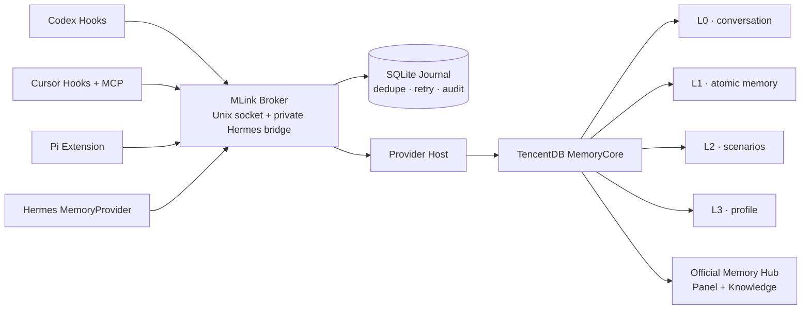

<div align="center">


[English](README.md) · [简体中文](README.zh-CN.md)

**A local-first memory integration and control plane for Codex, Cursor, Pi, and Hermes Agent.**

MLink connects agents to shared memory without replacing their model provider, subscription, API key, or login flow.

[](https://go.dev/)
[](#requirements)
[](https://github.com/Chenkeliang/mlink/releases/tag/v0.1.0-rc.2)
[](#what-mlink-does-not-do)

</div>

## What MLink is

MLink is the layer between an agent and a memory backend.

It provides the integration pieces that a memory engine does not provide on its own:

- Agent-native Hooks, Extensions, MCP, and MemoryProvider adapters;
- permanent backend identity before the first memory write;
- deterministic routing for local users, Feishu DMs, groups, and topics;
- per-principal isolation instead of one blended group profile;
- capture deduplication, retry, ambiguous-write audit, and operator recovery;
- guided install, Doctor, semantic uninstall, credential inventory, and full-machine recovery.

MLink does **not** implement a second memory engine. TencentDB MemoryCore currently supplies storage, extraction, retrieval, metadata, ACLs, and the L0–L3 memory model. MLink makes those capabilities usable and operationally safe across different agents.

## The problems it solves

### One memory backend, four incompatible agent surfaces

Codex, Cursor, Pi, and Hermes do not expose the same extension mechanism. MLink gives each agent a native integration while keeping routing policy in one Broker.

### Stable identity without profile pollution

Display names and chat participants are not safe memory keys. MLink provisions permanent Core IDs, binds the local owner to stable external identity, and maps other DMs and groups to isolated dynamic Agents.

### Memory reliability outside the model context

Retries can duplicate a non-idempotent memory write. MLink records capture state in a SQLite Journal, distinguishes retryable failures from ambiguous writes, and requires audited operator resolution where replay would be unsafe.

### Recovery without changing IDs

A full encrypted backup carries MemoryCore, Knowledge, MLink state, Keychain material, identity mappings, and Agent selection. Restore verifies the original User, Team, Agent, Asset, dynamic mappings, SQLite databases, and canonical volume contents. It never silently creates replacement IDs.

## Supported integrations

### Agents

| Agent | Integration | Recall | Capture | Current status |
|---|---|---:|---:|---|
| Codex | lifecycle Hooks | Yes | Yes | Implemented and locally accepted |
| Cursor Desktop / CLI | fail-open Hooks + stdio MCP | Yes | Yes | Implemented and locally accepted |
| Pi | native Extension | Yes | Yes | Implemented and locally accepted |
| Hermes Agent | MemoryProvider plugin + private Broker bridge | Yes | Yes | Implemented; Feishu DM/group/topic routing supported |

### Memory Providers

| Provider | Status | Notes |
|---|---|---|
| TencentDB MemoryCore | **Implemented** | First production connector; official Core and Memory Hub images are digest-pinned |
| mem0 | Not implemented | The Provider boundary is designed for it, but no production connector ships today |
| Other backends | Not implemented | Require a versioned Provider connector and lifecycle driver |

Provider extensibility is an architecture property, not a claim that every backend is already supported.

## Architecture



The Broker is the runtime policy boundary. Agent-side adapters never receive the MemoryCore Gateway token.

## Identity and memory isolation

| Context | Backend identity | Session boundary | Layers |
|---|---|---|---|
| Local owner in Codex / Cursor / Pi | Core-generated Owner | Agent conversation | L1 + L2 + L3 |
| Owner in Hermes DM | stable Feishu binding → Owner | DM conversation | L1 + L2 + L3 |
| Another Hermes DM user | stable principal → dynamic Agent | DM conversation | isolated L1 |
| Feishu group | stable group principal → dynamic Agent | group or topic ID | isolated L1 |

Raw Feishu IDs stay in Keychain-backed bindings or are reduced to HMAC fingerprints. A display-name change does not create a new memory identity.

## Requirements

The currently accepted runtime target is intentionally narrow:

- macOS on Apple Silicon (`darwin/arm64`);
- Docker-compatible local runtime; development and acceptance use OrbStack;
- official TencentDB MemoryCore and Memory Hub images pinned by digest;
- an OpenAI-compatible Memory LLM endpoint, accessible model, and API key for MemoryCore extraction;
- Go 1.27.x when building from source;
- the agent applications you want to connect.

The Memory LLM is used by MemoryCore for extraction. It does not replace the model used by Codex, Cursor, Pi, or Hermes.

## Installation

### Option 1: public pre-release

The latest published build is [`v0.1.0-rc.2`](https://github.com/Chenkeliang/mlink/releases/tag/v0.1.0-rc.2) for macOS arm64.

```bash
curl -LO https://github.com/Chenkeliang/mlink/releases/download/v0.1.0-rc.2/mlink_0.1.0-rc.2_darwin_arm64.tar.gz
curl -LO https://github.com/Chenkeliang/mlink/releases/download/v0.1.0-rc.2/checksums.txt
grep 'tar.gz$' checksums.txt | shasum -a 256 -c -
tar -xzf mlink_0.1.0-rc.2_darwin_arm64.tar.gz
grep '  mlink$' checksums.txt | shasum -a 256 -c -
install -m 0755 mlink "$HOME/.local/bin/mlink"
mlink
```

`v0.1.0-rc.2` is a pre-release. The current source tree contains newer, unreleased full-backup and restore hardening; build from source if you need the exact behavior documented below.

### Option 2: build the current source

```bash
git clone https://github.com/Chenkeliang/mlink.git
cd mlink
go build -trimpath -o mlink ./cmd/mlink
./mlink
```

### npm / npx status

The checksum-verifying `@mlink/cli` bootstrap is implemented in this repository, but **it is not published to npm yet**. Do not rely on `npx @mlink/cli setup` until a package version appears in the npm registry.

The bootstrap remains deliberately thin: it downloads a pinned native release, verifies hashes, installs the binary atomically, and starts the TUI. It does not duplicate MLink's configuration logic in JavaScript.

## First-run workflows

Running `mlink` starts the guided TUI.

### New installation

```text
Detect dependencies
→ install official local MemoryCore
→ enter Memory LLM settings
→ create permanent Core User / Team / Agent / Asset IDs
→ select Agents
→ preview exact Plan
→ apply
→ Doctor
→ optional official Memory Hub
```

Agent capture is not enabled before permanent Core identity exists.

### Connect an existing MemoryCore

Use the TUI or the explicit CLI control-plane flow. Local endpoints may use HTTP; remote endpoints must use HTTPS.

```bash
mlink provider status --json
mlink control-plane provision \
  --dynamic-agent-limit 500 \
  --endpoint <https-or-loopback-memorycore-url> \
  --service-id <memorycore-service-id> \
  --installation-id <stable-installation-id> \
  --owner <owner-name> \
  --secrets-stdin \
  --dry-run --json
```

Every mutation must be reproduced with its exact Plan ID and `--yes` before it can apply.

### Move the complete workspace to another Mac

```bash
# Source Mac: preview, then apply the exact Plan.
mlink backup create \
  --output /absolute/path/workspace.mlink-backup \
  --passphrase-stdin --dry-run --json

mlink backup create \
  --output /absolute/path/workspace.mlink-backup \
  --passphrase-stdin --apply-plan <exact-plan-id> --yes

# Destination Mac: inspect, preview, then restore.
mlink backup inspect /absolute/path/workspace.mlink-backup \
  --passphrase-stdin --json

mlink backup restore /absolute/path/workspace.mlink-backup \
  --passphrase-stdin --dry-run --json

mlink backup restore /absolute/path/workspace.mlink-backup \
  --passphrase-stdin --apply-plan <exact-plan-id> --yes
```

Full restore currently targets a clean local macOS arm64 destination. It refuses existing containers, networks, non-empty volumes, local state files, or colliding Keychain accounts.

## Operations

```text
mlink                                      Guided TUI
mlink status [--json]                      Installed state and active adapters
mlink doctor [agent] [--json]              Read-only health and identity checks
mlink provider status [--json]             Backend detection
mlink config diff [--json]                 Owned-resource drift
mlink credentials status [--json]          Redacted Keychain inventory
mlink credentials copy panel-owner --yes   Copy the Panel Owner login key
mlink credentials copy panel-admin --yes   Copy the Panel Admin login key
mlink backup list [--json]                  Automatic install rollback artifacts
mlink backup create / inspect / restore    Full encrypted workspace portability
mlink identity list                        Stable external identity bindings
mlink maintenance journal ...              Resolve ambiguous capture events
mlink maintenance upgrade ...              Verified atomic native upgrade
mlink adapter enable cursor ...            Incremental Cursor integration
mlink panel status | open                  Official Memory Hub Panel
```

## Safety model

- Secrets are stored in macOS Keychain and are absent from Plan JSON and normal logs.
- Agent model/provider/authentication fields are protected semantic invariants.
- Codex and Cursor Hooks fail open: memory downtime does not block the agent.
- Backup uses authenticated outer encryption plus independently encrypted sections.
- Restore binds confirmation to the encrypted bundle SHA-256 and uses a private immutable ciphertext copy during Apply.
- Journal and Provider SQLite databases pass `quick_check`; restored volumes must match canonical content fingerprints.
- Restore verifies fixed and dynamic backend IDs before Agent integrations are enabled.
- Ordinary uninstall removes owned integrations and containers but retains MemoryCore and Knowledge data volumes.
- Full state deletion is blocked while queued or unresolved Journal events exist.

## What MLink does not do

MLink does not:

- proxy agent prompts or completions to an LLM provider;
- change an agent's model URL, vendor, subscription, API key, or login session;
- expose the MemoryCore Gateway token to an Agent Hook, Extension, or MCP config;
- blend multiple Feishu principals into one shared personal profile;
- auto-replay an ambiguous non-idempotent write;
- automatically migrate HyMemory, mem0, or another backend's existing memories;
- provide its own Web admin system—the optional UI is TencentDB's official Memory Hub;
- delete persistent Core or Knowledge volumes during ordinary uninstall.

## Current stage

| Area | Status |
|---|---|
| Core Broker, Journal, identity routing | Implemented |
| Codex, Cursor, Pi, Hermes integrations | Implemented and locally accepted |
| TencentDB MemoryCore lifecycle | Implemented with official pinned image |
| Official Memory Hub / Panel / Knowledge | Implemented |
| Full encrypted backup and ID-preserving restore | Implemented in current source; destructive local acceptance passed |
| Public GitHub release | `v0.1.0-rc.2` pre-release |
| npm / npx distribution | Bootstrap implemented; package not published |
| Homebrew distribution | Not published |
| mem0 connector | Not implemented |
| Linux, Windows, Intel macOS | Not accepted or released |
| HyMemory migration | Not implemented |

## Known limitations

- The accepted platform is macOS arm64; other platforms fail restore preflight.
- The first production Provider is TencentDB MemoryCore only.
- Full volume backup/restore is for a local Docker/OrbStack deployment, not an arbitrary remote service.
- A compatible and authorized Memory LLM is required for new L1/L2/L3 extraction.
- Hermes integration requires a reachable Hermes environment; the default detected OrbStack machine is `hermes-agent-env`.
- Codex or Cursor may report a pending trust/first-turn state until the host accepts and invokes the new integration.
- Knowledge volume backup preserves existing Knowledge data, but MLink does not yet ingest or schedule private Git repositories by itself.
- A full backup contains encrypted credentials. Keep the bundle and passphrase separate.
- The official Memory Hub provides the current Panel; MLink does not yet ship a separate multi-user Web console.

## Development and verification

```bash
go test ./... -count=1
go test ./... -shuffle=on -count=1
go test -race ./internal/workspacebackup ./internal/provider/tencentdb ./internal/controlplane ./internal/app ./internal/e2e
go vet ./...

cd packages/cli
npm test
```

The current source has passed isolated fresh-install acceptance, full local uninstall/recovery acceptance, fixed/dynamic ID verification, real memory capture/recall, and full-workspace restore. See [docs/testing](docs/testing) for detailed evidence and [AGENTS.md](AGENTS.md) for product and security constraints.
