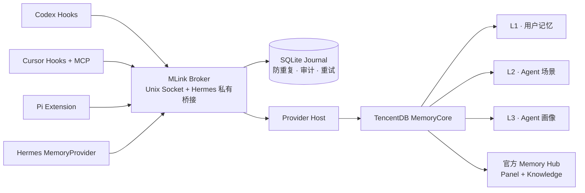

<div align="center">


[English](README.md) · [简体中文](README.zh-CN.md)

让 Codex、Cursor、Pi 与 Hermes Agent 共享同一套本地记忆服务，同时保留各自原有的模型供应商、订阅账号、API Key 与登录方式。

[](https://go.dev/)
[](#mlink-不会修改什么)
[](#架构)

</div>

## 为什么需要 MLink

每个 Agent 都有自己的生命周期、配置格式和记忆入口。MLink 在不破坏这些边界的前提下，为它们提供统一的记忆平面：

- **Codex**：通过生命周期 Hooks 召回和写入记忆。
- **Cursor Desktop / CLI**：通过 fail-open Hooks 写入，并通过 stdio MCP 做面向当前问题的精确召回。
- **Pi**：通过原生 Extension 接入。
- **Hermes Agent**：通过 MemoryProvider 桥接，并支持飞书私聊、群聊和话题路由。
- **TencentDB MemoryCore**：首个生产级 Memory Provider，支持官方 Memory Hub 管理面板。

MLink 不是 LLM Proxy。Agent 仍然使用原有模型账号和供应商，MLink 只负责记忆。

## MLink 真正解决什么

TencentDB Agent Memory 本身已经提供多用户和团队级记忆基础：User 与 User Key、Team 与成员关系、Agent 与 Task、资产所有权与 ACL，以及 L0–L3 记忆引擎。MLink 不替代、也不重复实现这些能力。

MLink 的作用，是把这些基础能力变成适用于不同 Agent 和聊天渠道的一致接入层：

| 边界 | TencentDB Agent Memory 提供 | MLink 提供 |
|---|---|---|
| 记忆引擎 | L0–L3 提取、存储与检索 | 通过版本化 Provider 使用引擎，不重复实现 |
| 后端身份 | User、Team、Agent、Task、Asset、User Key 与 ACL API | 第一次写入前创建并固定正式 Core ID；每次启动都校验一致性 |
| Agent 接入 | HTTP API、SDK，以及可选的 LLM Proxy | Codex Hooks、Cursor Hooks/MCP、Pi Extension、Hermes MemoryProvider，并保持原有模型链路不变 |
| 外部身份 | 要求调用方提供明确的 User / Team / Agent | 将飞书稳定身份、群聊和话题映射为确定的 MLink 路由 |
| Session 路由 | 接收调用方提供的身份与 Session 维度 | 自动生成稳定的私聊、群聊、话题和本机 Agent Session |
| 隔离策略 | 按 Core 身份维度存储和检索 | Owner 使用 L1/L2/L3；其他私聊用户和群聊只访问各自隔离的 L1 路由 |
| 写入可靠性 | Memory Capture / Recall API | SQLite Journal 防重复、重试、歧义写入审计与人工处置 |
| 安装运维 | MemoryCore 与 Memory Hub Runtime | 检测、引导安装、精确 Plan、备份、升级、卸载与 Doctor |

在当前 Hermes 集成中，Owner 是正式的 MemoryCore 普通 User；其他飞书私聊主体和群聊分别映射为 Owner Team 下的独立动态 Agent。MLink 提供的是“多外部主体隔离接入”，不会声称每个飞书成员都已注册为独立的 MemoryCore User。

## 架构



Broker 是唯一的策略边界。Agent 侧的 Hook、Extension 和 MCP 都拿不到 MemoryCore Token；不同记忆产品的差异被隔离在版本化 Provider 接口之后。

## 记忆与多用户隔离

| 场景 | 用户身份 | Session 身份 | 记忆层级 |
|---|---|---|---|
| 本机 Owner：Codex / Cursor / Pi | MemoryCore 生成的 Owner | Agent 会话 | L1 + L2 + L3 |
| Owner 的 Hermes 飞书私聊 | 稳定飞书绑定 → Owner | 飞书会话 | L1 + L2 + L3 |
| 其他 Hermes 私聊用户 | 稳定用户指纹 → 动态 Agent | 飞书会话 | L1 |
| 飞书群聊 | 稳定群指纹 → 动态 Agent | 群 ID 或话题 ID | L1 |

显示名称变化不会导致身份变化。飞书原始 ID 只存在于 Keychain 保护的绑定中，或被转换为 HMAC 指纹；它们不会成为公开的 MemoryCore 标签。

### 正式 ID 在第一次写入前固定

MLink 不会先用自定义 `agent_id` 写记忆，再等 Panel 安装后迁移：

1. 检测或安装 MemoryCore；
2. 通过 MemoryCore 官方元数据 API 创建 Owner User、Team、Agent 与 Chat Memory Asset；
3. 将 MemoryCore 返回的正式 ID 写入本地 Journal；
4. 生成第一份 Schema v3 配置；
5. 最后才启用 Agent Hook、MCP、Extension 和 Broker。

如果中途只完成了 MemoryCore 安装，MLink 会停留在“等待正式身份”状态，不会允许 Agent 写入。以后安装 Memory Hub 时只复用这些已有 ID，不会创建第二套身份。

## 快速开始

### 方式一：下载预发布版本

当前版本：[v0.1.0-rc.2](https://github.com/Chenkeliang/mlink/releases/tag/v0.1.0-rc.2)

下载对应平台的二进制后运行：

```bash
chmod +x mlink
./mlink
```

### 方式二：使用 Go 1.27 构建

```bash
go build -trimpath -o mlink ./cmd/mlink
./mlink
```

首次运行会进入引导式 TUI。向导会：

1. 检测 Codex、Cursor、Pi 和 Hermes；
2. 选择 Memory Provider；
3. 检测 MemoryCore 是否已存在；
4. 在“安装官方本地 MemoryCore”和“连接已有 MemoryCore”之间选择；
5. 选择本机 Owner 对应的飞书稳定身份，也可跳过飞书并禁用 Hermes；
6. 设置动态 Agent 上限；
7. 先创建正式 Core 身份，再选择需要安装的 Agent；
8. 展示完整变更 Plan，确认后才写入；
9. 运行 Doctor，并可选安装官方 Memory Hub。

欢迎页直接提供“新安装”“从加密备份恢复”“连接已有 MemoryCore”三条主路径；按 `b` 可创建全量加密备份，按 `c` 可查看脱敏凭据状态并受控复制 Panel 登录 Key。

所有文件与服务变更都必须经过同一流程：

```text
检测 → 预览 → 精确 Plan ID → 明确确认 → 备份 → 应用 → 验证
                                              ↘ 失败时回滚
```

### 验证安装

```bash
mlink status --json
mlink doctor --json
mlink version --json
```

### 已安装 MLink：补充启用 Cursor

```bash
mlink adapter enable cursor --dry-run --json
mlink adapter enable cursor --apply-plan <精确-plan-id> --yes
```

### 把整套记忆迁移到另一台 Mac

```bash
mlink backup create \
  --output /绝对路径/workspace.mlink-backup \
  --passphrase-stdin --dry-run --json

mlink backup create \
  --output /绝对路径/workspace.mlink-backup \
  --passphrase-stdin --apply-plan <精确-plan-id> --yes

# 在新电脑上：
mlink backup inspect /绝对路径/workspace.mlink-backup --passphrase-stdin --json
mlink backup restore /绝对路径/workspace.mlink-backup --passphrase-stdin --dry-run --json
mlink backup restore /绝对路径/workspace.mlink-backup --passphrase-stdin --apply-plan <精确-plan-id> --yes
```

全量工作区备份会加密保存 MemoryCore 与 Knowledge 卷、MemoryCore 原始运行配置、MLink 配置与 Journal、Core 生成的固定/动态 ID、Keychain 材料、稳定身份绑定，以及已选择的 Agent 接入。恢复时保留原 ID，不会创建替代 ID，也不会把记忆“迁移”到另一套身份图。

它与下面两种备份不同：

- `mlink backup list`：只用于当前电脑安装变更的自动回滚；
- `mlink identity export/import`：只迁移身份，不包含 MemoryCore/Knowledge 数据。

## 后端接入方式

推荐通过 TUI 完成首次接入，避免在 Shell 历史中暴露凭据。

CLI 同样支持两种路径：

### 安装官方本地 MemoryCore

```text
mlink provider status --json
mlink provider install tencentdb \
  --endpoint http://127.0.0.1:8420 \
  --llm-base-url <memory-llm-url> \
  --llm-model <memory-llm-model> \
  --secrets-stdin \
  --dry-run --json
```

`--secrets-stdin` 读取受保护 JSON，其中包含 Gateway Token 和 Memory LLM API Key。密钥不会进入 argv、Plan、日志、普通配置或未加密文件；只有明确创建的全量加密包会包含可恢复的密钥段。

### 连接已有 MemoryCore

```text
mlink control-plane provision \
  --dynamic-agent-limit 500 \
  --endpoint <https-or-loopback-memorycore-url> \
  --service-id <memorycore-service-id> \
  --installation-id <stable-installation-id> \
  --owner <owner-name> \
  --secrets-stdin \
  --dry-run --json
```

远程 MemoryCore 必须使用 HTTPS，本机回环地址可以使用 HTTP。应用时仍需重新生成同一个 Plan，并同时提供 `--apply-plan <id> --yes`。

## 常用命令

```text
mlink                                      引导式 TUI
mlink provider status ...                  检测 Memory Provider 后端
mlink provider install tencentdb ...       安装或启动官方 MemoryCore
mlink control-plane provision ...          创建并固定正式 Core 身份
mlink install ...                          预览/应用 Agent 首次安装
mlink status [--json]                      查看已安装 Agent 与当前连接
mlink doctor [agent] [--json]              只读检查依赖、身份和运行状态
mlink config diff [--json]                 检查 MLink 所有资源是否漂移
mlink backup list [--json]                 查看自动回滚备份
mlink backup create / inspect / restore    全量加密备份、检查与换机恢复
mlink credentials status [--json]          查看脱敏 Keychain 凭据清单
mlink credentials copy panel-* --yes       受控复制 Panel 登录 Key
mlink identity list [--json]               查看稳定身份绑定
mlink identity export / import ...         加密导出与迁移身份
mlink panel status | open                  管理官方 Memory Hub
mlink maintenance journal ...              审计并处理未决事件
mlink maintenance credentials rotate ...  轮换 Hermes Grant
mlink maintenance upgrade ...              原子升级本机二进制
mlink adapter enable cursor ...            增量启用 Cursor
```

## MLink 不会修改什么

MLink 不会：

- 修改 Agent 的模型、Base URL、模型厂商、API Key、订阅或登录状态；
- 代理 Agent 与 LLM 之间的 Prompt 或 Completion；
- 把 MemoryCore 凭据写入 Agent Hook、Extension 或 MCP 配置；
- 把多个飞书用户合并成一个个人画像；
- 自动重放结果不明确且不具备安全重试条件的记忆写入；
- 在普通卸载时删除 MemoryCore 记忆数据卷或 Knowledge 数据卷。

## 可插拔 Provider 边界

TencentDB MemoryCore 是首个真实 Provider，但不是硬编码的能力上限。Provider 以独立清单进程运行，实现版本化的 Health、Recall、Capture 与 Shutdown 协议。

未来接入 mem0 等记忆产品时，只需实现 Provider Connector 和后端生命周期，不需要重写 Codex、Cursor、Pi、Hermes 或 Broker。

## 安全与恢复

- 密钥保存在 macOS Keychain，Plan 和日志只包含指纹或存在性标记。
- 全量备份采用“外层认证加密 + 分段独立加密”；暂存目录只出现密文且权限为 `0700`，最终包权限为 `0600`。
- 恢复只创建空的正式资源，使用官方 digest 固定镜像启动 Core，密钥不进入 argv；固定 ID 与动态 Agent/Asset ID 验证一致后才安装 Agent 接入。
- 主 Journal 尚未恢复时，由不含路径、密钥和原始 ID 的 sidecar 记录中断阶段；Journal schema v7 保存恢复阶段与已验证包指纹。
- `mlink doctor` 会显示 `backup.last_verified`、`restore.state` 与 `restore.identity_gate`。
- SQLite Journal 负责防重复、投递状态、审计与安全重试。
- Codex 和 Cursor Hooks 采用 fail-open；记忆不可用时不会阻塞 Agent。
- 官方 MemoryCore 与 Memory Hub 镜像固定到明确 digest。
- Doctor 会逐项核对配置中的 User、Team、Agent、Asset 是否与 Journal 中 MemoryCore 返回的正式 ID 一致。
- 普通卸载只删除所有权验证通过的容器与配置，并保留记忆数据卷。
- 二进制升级会校验平台与配置 Schema，再原子替换并支持回滚。
- JSON、YAML、MCP Server、Hook 和 Hermes 模型/认证配置均采用语义合并，只修改 MLink 所有字段。

## 开发与验证

```bash
go test ./...
go test ./... -shuffle=on -count=1
go test -race ./internal/provider/tencentdb ./internal/controlplane ./internal/app ./internal/e2e
go vet ./...
```

发布基线为 Go 1.27.x。产品、安全与分发约束见 [AGENTS.md](AGENTS.md)，隔离测试和真实机器验收记录见 [docs/testing](docs/testing)。

## 当前状态

macOS arm64 上的 Codex、Cursor、Pi、Hermes、TencentDB MemoryCore 与官方 Memory Hub 本地记忆生命周期已经完成实现与验证。

当前预发布版本为 `v0.1.0-rc.2`。GitHub Release、校验和与构建溯源已发布；npm/npx Bootstrap 尚未发布，需完成 npm 账号登录并确认可用 scope。
