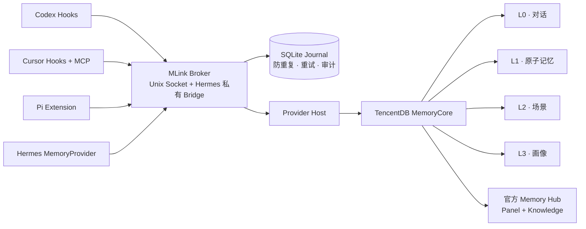

<div align="center">


[English](README.md) · [简体中文](README.zh-CN.md)

**面向 Codex、Cursor、Pi 与 Hermes Agent 的本地优先记忆接入与控制平面。**

MLink 让不同 Agent 连接同一套记忆，同时保留各自原有的模型供应商、订阅、API Key 与登录方式。

[](https://go.dev/)
[](#运行要求)
[](https://github.com/Chenkeliang/mlink/releases/tag/v0.1.0-rc.2)
[](#mlink-不会做什么)

</div>

## MLink 是什么

MLink 位于 Agent 与 Memory Provider 之间。

它补齐的是记忆引擎本身通常不负责的接入与运维能力：

- 面向 Agent 的原生 Hook、Extension、MCP 与 MemoryProvider；
- 第一次写记忆前先创建并固定后端正式身份；
- 本机用户、飞书私聊、群聊与话题的确定性路由；
- 按用户/群隔离，而不是把多人画像混成一份；
- 写入防重复、重试、歧义写入审计与人工恢复；
- TUI 引导安装、Doctor、语义卸载、凭据清单与整机迁移。

MLink **不重新实现记忆引擎**。当前由 TencentDB MemoryCore 提供存储、抽取、召回、元数据、ACL 与 L0–L3 记忆能力；MLink 负责让这些能力安全、一致地接入不同 Agent。

## 它解决什么问题

### 同一个记忆后端，四套不同的 Agent 接口

Codex、Cursor、Pi 与 Hermes 的扩展机制完全不同。MLink 为每个 Agent 使用其原生接入方式，同时把身份与路由策略集中在一个 Broker 中。

### 稳定身份与多用户隔离

显示名和聊天参与者不是可靠的记忆主键。MLink 使用 Core 生成的正式 ID 作为权威身份，将本机 Owner 绑定到稳定外部身份，并把其他私聊用户和群聊映射为隔离的动态 Agent。

### 上下文之外的写入可靠性

非幂等记忆写入不能无脑重试。MLink 使用 SQLite Journal 记录写入状态，区分可安全重试、永久失败和结果不明确的写入；无法确认的写入必须经过审计处置。

### 换机恢复但不更换 ID

全量加密包包含 MemoryCore、Knowledge、MLink 状态、Keychain 材料、身份映射和 Agent 选择。恢复时会校验原 User、Team、Agent、Asset、动态映射、SQLite 数据库和整卷内容，不会静默创建一套替代 ID。

## 已支持的接入

### Agent

| Agent | 接入方式 | 召回 | 写入 | 当前状态 |
|---|---|---:|---:|---|
| Codex | 生命周期 Hooks | 支持 | 支持 | 已实现并通过本机验收 |
| Cursor Desktop / CLI | fail-open Hooks + stdio MCP | 支持 | 支持 | 已实现并通过本机验收 |
| Pi | 原生 Extension | 支持 | 支持 | 已实现并通过本机验收 |
| Hermes Agent | MemoryProvider 插件 + 私有 Broker Bridge | 支持 | 支持 | 已实现，支持飞书私聊/群聊/话题路由 |

### Memory Provider

| Provider | 状态 | 说明 |
|---|---|---|
| TencentDB MemoryCore | **已实现** | 当前首个生产连接器；Core 与 Memory Hub 官方镜像均固定 digest |
| mem0 | 未实现 | 已有可插拔 Provider 边界，但目前没有可用连接器 |
| 其他后端 | 未实现 | 需要实现版本化 Provider Connector 与生命周期驱动 |

“架构可插拔”不等于“已经支持所有记忆产品”。

## 架构



Broker 是运行时策略边界。Agent 侧 Hook、Extension 与 MCP 不会拿到 MemoryCore Gateway Token。

## 身份与记忆隔离

| 场景 | 后端身份 | Session 边界 | 记忆层级 |
|---|---|---|---|
| 本机 Owner：Codex / Cursor / Pi | Core 生成的 Owner | Agent 会话 | L1 + L2 + L3 |
| Owner 的 Hermes 私聊 | 稳定飞书绑定 → Owner | 私聊会话 | L1 + L2 + L3 |
| 其他 Hermes 私聊用户 | 稳定主体 → 动态 Agent | 私聊会话 | 隔离 L1 |
| 飞书群聊 | 稳定群主体 → 动态 Agent | 群 ID 或话题 ID | 隔离 L1 |

飞书原始 ID 只保存在 Keychain 保护的 Binding 中，或被转换为 HMAC 指纹。修改显示名称不会创建新的记忆身份。

## 运行要求

当前已经验收的运行目标有意保持收敛：

- Apple Silicon Mac（`darwin/arm64`）；
- 本地 Docker 兼容运行时；开发和验收使用 OrbStack；
- 固定 digest 的官方 TencentDB MemoryCore 与 Memory Hub 镜像；
- MemoryCore 抽取所需的 OpenAI-compatible LLM 地址、可访问模型与 API Key；
- 从源码构建时使用 Go 1.27.x；
- 需要接入的 Agent 应已安装。

Memory LLM 只供 MemoryCore 抽取 L1/L2/L3 使用，不会替换 Codex、Cursor、Pi 或 Hermes 自己使用的模型。

## 安装

### 方式一：公开预发布版本

目前最新公开版本是面向 macOS arm64 的 [`v0.1.0-rc.2`](https://github.com/Chenkeliang/mlink/releases/tag/v0.1.0-rc.2)。

```bash
curl -LO https://github.com/Chenkeliang/mlink/releases/download/v0.1.0-rc.2/mlink_0.1.0-rc.2_darwin_arm64.tar.gz
curl -LO https://github.com/Chenkeliang/mlink/releases/download/v0.1.0-rc.2/checksums.txt
grep 'tar.gz$' checksums.txt | shasum -a 256 -c -
tar -xzf mlink_0.1.0-rc.2_darwin_arm64.tar.gz
grep '  mlink$' checksums.txt | shasum -a 256 -c -
install -m 0755 mlink "$HOME/.local/bin/mlink"
mlink
```

`v0.1.0-rc.2` 仍是预发布版本。当前源码已经包含更新但尚未发布的全量备份/恢复加固；若需要本文描述的最新行为，请从源码构建。

### 方式二：构建当前源码

```bash
git clone https://github.com/Chenkeliang/mlink.git
cd mlink
go build -trimpath -o mlink ./cmd/mlink
./mlink
```

### npm / npx 当前状态

仓库中已经实现带双重 SHA-256 校验的 `@mlink/cli` 薄引导器，但它 **尚未发布到 npm**。在 npm Registry 出现真实版本前，不要依赖 `npx @mlink/cli setup`。

这个 npm 包只负责下载固定版本的原生二进制、校验、原子安装并启动 TUI，不会用 JavaScript 复制 MLink 的配置和运维逻辑。

## 首次运行流程

运行 `mlink` 会进入引导式 TUI。

### 全新安装

```text
检测依赖
→ 安装官方本地 MemoryCore
→ 输入 Memory LLM 配置
→ 创建永久 Core User / Team / Agent / Asset ID
→ 选择 Agent
→ 预览精确 Plan
→ 应用
→ Doctor
→ 可选安装官方 Memory Hub
```

正式 Core 身份创建完成前，Agent Capture 不会启用。

### 连接已有 MemoryCore

可以使用 TUI，也可以使用显式 CLI。回环地址允许 HTTP，远程地址必须使用 HTTPS。

```bash
mlink provider status --json
mlink control-plane provision \
  --dynamic-agent-limit 500 \
  --endpoint <https-or-loopback-memorycore-url> \
  --service-id <memorycore-service-id> \
  --installation-id <stable-installation-id> \
  --owner <owner-name> \
  --secrets-stdin \
  --dry-run --json
```

所有写操作都必须使用重新生成且完全一致的 Plan ID，并显式提供 `--yes`。

### 把完整工作区迁移到另一台 Mac

```bash
# 源 Mac：先预览，再应用精确 Plan。
mlink backup create \
  --output /绝对路径/workspace.mlink-backup \
  --passphrase-stdin --dry-run --json

mlink backup create \
  --output /绝对路径/workspace.mlink-backup \
  --passphrase-stdin --apply-plan <精确-plan-id> --yes

# 目标 Mac：先检查，再预览和恢复。
mlink backup inspect /绝对路径/workspace.mlink-backup \
  --passphrase-stdin --json

mlink backup restore /绝对路径/workspace.mlink-backup \
  --passphrase-stdin --dry-run --json

mlink backup restore /绝对路径/workspace.mlink-backup \
  --passphrase-stdin --apply-plan <精确-plan-id> --yes
```

当前全量恢复面向干净的本地 macOS arm64 目标机。只要发现已有容器、网络、非空卷、本地状态文件或 Keychain 凭据冲突，就会拒绝覆盖。

## 常用运维命令

```text
mlink                                      引导式 TUI
mlink status [--json]                      当前安装状态与 Agent
mlink doctor [agent] [--json]              只读健康与身份检查
mlink provider status [--json]             检测 Memory Provider
mlink config diff [--json]                 检查所有权资源漂移
mlink credentials status [--json]          查看脱敏 Keychain 凭据清单
mlink credentials copy panel-owner --yes   复制 Panel Owner 登录 Key
mlink credentials copy panel-admin --yes   复制 Panel Admin 登录 Key
mlink backup list [--json]                 查看安装变更自动回滚备份
mlink backup create / inspect / restore    全量加密备份与换机恢复
mlink identity list                        查看稳定外部身份 Binding
mlink maintenance journal ...              处置歧义 Capture 事件
mlink maintenance upgrade ...              校验后原子升级原生二进制
mlink adapter enable cursor ...            增量启用 Cursor
mlink panel status | open                  官方 Memory Hub Panel
```

## 安全机制

- 密钥保存在 macOS Keychain，不进入 Plan JSON 与普通日志。
- Agent 的模型、Provider 与认证字段是受保护的语义不变量。
- Codex 与 Cursor Hook 采用 fail-open，记忆故障不会阻塞 Agent。
- 全量包采用“外层认证加密 + 分段独立加密”。
- 恢复确认绑定加密包 SHA-256；Apply 全程只使用私有不可变密文副本。
- Journal 与 Provider SQLite 必须通过 `quick_check`，恢复卷必须匹配规范化内容指纹。
- 固定 ID 与动态 Agent/Asset ID 验证完成后才启用 Agent 接入。
- 普通卸载删除所有权明确的接入与容器，但保留 Core 和 Knowledge 数据卷。
- Journal 中仍有排队或未决事件时，禁止完整删除状态。

## MLink 不会做什么

MLink 不会：

- 代理 Agent 发给 LLM 的 Prompt 或 Completion；
- 修改 Agent 的模型地址、厂商、订阅、API Key 或登录状态；
- 把 MemoryCore Gateway Token 写进 Hook、Extension 或 MCP 配置；
- 把多个飞书主体合并成一个个人画像；
- 自动重放结果不明确的非幂等写入；
- 自动迁移 HyMemory、mem0 或其他后端已有记忆；
- 自建另一套 Web 管理后台——当前可选 UI 是腾讯官方 Memory Hub；
- 在普通卸载时删除持久化 Core 或 Knowledge 数据卷。

## 当前阶段

| 能力 | 状态 |
|---|---|
| Broker、Journal、身份与路由 | 已实现 |
| Codex、Cursor、Pi、Hermes 接入 | 已实现并通过本机验收 |
| TencentDB MemoryCore 生命周期 | 已实现，使用官方固定镜像 |
| 官方 Memory Hub / Panel / Knowledge | 已实现 |
| 全量加密备份与保 ID 恢复 | 当前源码已实现，真实卸载/恢复验收通过 |
| GitHub 公共版本 | `v0.1.0-rc.2` 预发布 |
| npm / npx 分发 | Bootstrap 已实现，包未发布 |
| Homebrew 分发 | 未发布 |
| mem0 Connector | 未实现 |
| Linux、Windows、Intel Mac | 未验收、未发布 |
| HyMemory 迁移 | 未实现 |

## 已知限制

- 当前正式验收平台只有 macOS arm64，其他平台会在恢复预检阶段拒绝。
- 当前唯一生产级 Provider 是 TencentDB MemoryCore。
- 全量卷备份/恢复面向本地 Docker/OrbStack，不支持对任意远程服务做卷快照。
- 新的 L1/L2/L3 抽取依赖 Memory LLM 的 Key 确实有权调用配置模型。
- Hermes 接入要求 Hermes 环境可达，默认检测的 OrbStack 机器名是 `hermes-agent-env`。
- Codex 或 Cursor 可能在宿主首次信任/首次调用前显示 pending 状态。
- Knowledge 卷会完整备份，但 MLink 尚不会自动导入或定时同步私有 Git 仓库。
- 全量包包含加密后的凭据，请把包与口令分开保存。
- 当前 Panel 来自官方 Memory Hub，MLink 尚未提供独立的多用户 Web 控制台。

## 开发与验证

```bash
go test ./... -count=1
go test ./... -shuffle=on -count=1
go test -race ./internal/workspacebackup ./internal/provider/tencentdb ./internal/controlplane ./internal/app ./internal/e2e
go vet ./...

cd packages/cli
npm test
```

当前源码已经通过隔离全新安装、真实整机卸载/恢复、固定与动态 ID 校验、真实记忆写入/召回以及完整工作区恢复。详细证据见 [docs/testing](docs/testing)，产品与安全约束见 [AGENTS.md](AGENTS.md)。
