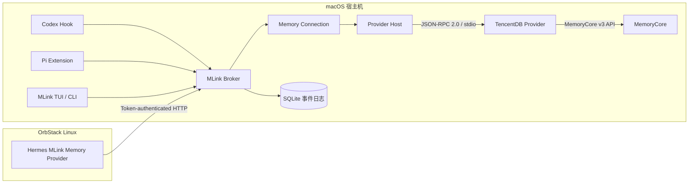
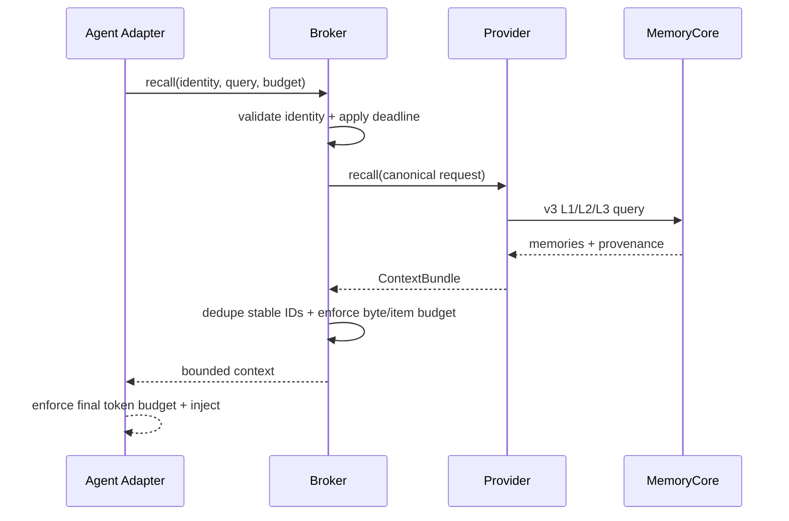
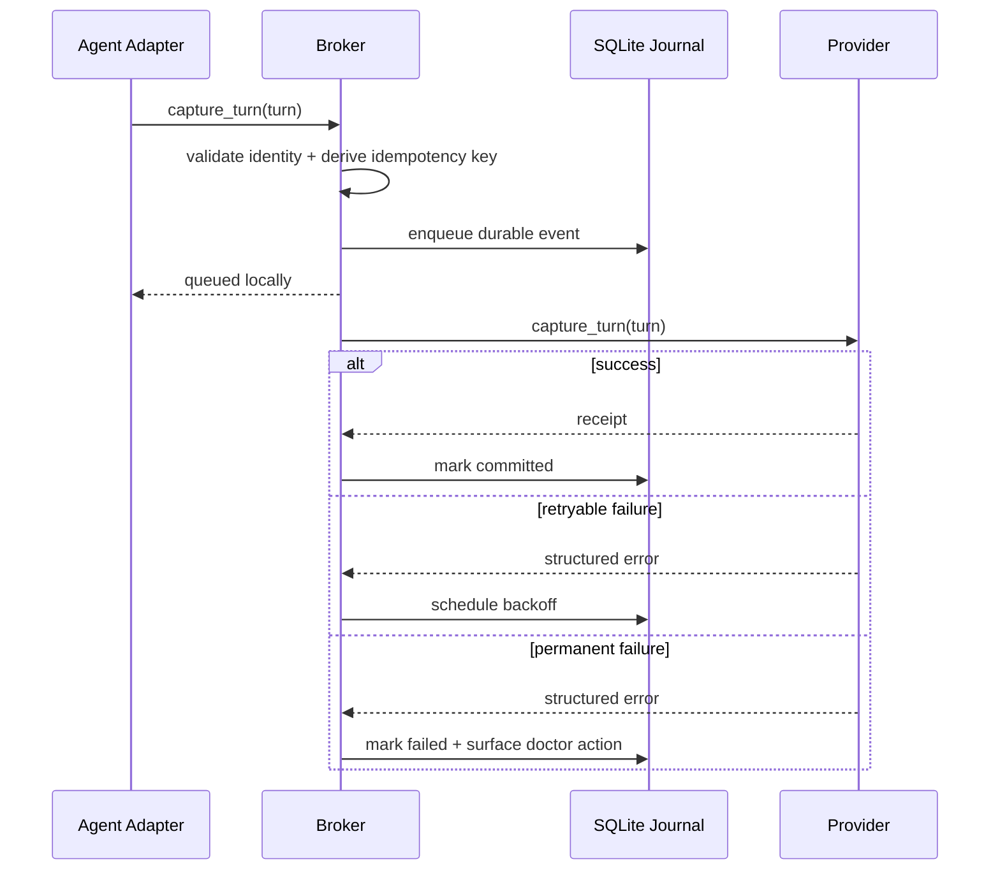

# MLink MVP 设计规格

- 状态：第二轮架构审查完成，待用户复核
- 日期：2026-08-28
- 目标版本：MVP
- 首批 Agent：Codex、Pi、Hermes Agent
- 首个记忆 Provider：TencentDB MemoryCore

## 1. 摘要

MLink 是安装在用户宿主机上的“记忆连接层”。它把不同 Agent 的生命周期事件转换成统一的记忆读取和写入请求，再交给可插拔的记忆 Provider。MLink 不代理 LLM 请求，不修改模型地址、订阅登录、API Key 或认证链路。

MVP 使用 Go 构建单一 `mlink` 可执行文件，提供：

1. 向导式 TUI，用于发现环境、选择 Provider、配置身份、选择 Agent、预览变更、安装和验证。
2. 本地 Broker，统一处理身份、召回预算、超时、幂等、异步写入和 Provider 路由。
3. 语言无关的 Provider 协议，首版内置 TencentDB Provider，后续可独立增加 Mem0 等 Provider。
4. Codex Hook、Pi Extension、Hermes Memory Provider 三种薄适配器。
5. 可审计、可备份、可卸载的配置管理；仅修改 MLink 所拥有的配置片段。

首次运行 `mlink` 进入安装向导；安装完成后再次运行进入状态面板，并可重新配置。所有向导动作都有等价的非交互 CLI，便于批量安装和自动化。

## 2. 问题与背景

当前各 Agent 的记忆接入方式不同：

- Codex 通过 Hook 生命周期注入和回写上下文。
- Pi 通过 Extension 事件注入、采集和注册工具。
- Hermes 通过外部 Memory Provider 插件完成 `prefetch` 与 `sync_turn`。
- TencentDB、Mem0、Hindsight、Graphiti 等记忆系统的身份模型、检索接口和高级能力又各不相同。

如果每个 Agent 直接对接每个记忆系统，会形成 `Agent × Provider` 的适配矩阵；任何 Provider 升级、身份规则变化或安全策略调整都要重复修改多个 Agent。MLink 的目标是把这个矩阵拆成两条稳定边界：

```text
Agent ── Agent Adapter ── MLink Broker ── Provider Adapter ── Memory Backend
```

Agent Adapter 只理解 Agent 生命周期；Provider Adapter 只理解记忆后端。二者通过 MLink 的规范化模型解耦。

## 3. 设计目标

### 3.1 MVP 必须实现

1. 在 macOS 宿主机安装和运行 MLink。
2. 连接一个已经存在的 TencentDB MemoryCore 实例。
3. 支持宿主机上的 Codex 与 Pi。
4. 支持 OrbStack Linux 环境中的 Hermes Agent。
5. 读取记忆时按稳定用户身份隔离，不使用昵称作为主键。
6. 写入完整的用户与助手回合，防止同一回合因 Hook 重试而重复写入。
7. 记忆服务异常时 Agent 继续工作；读取失败不阻塞推理，写入失败可重试。
8. 安装前预览配置变化，安装后逐项验证，卸载时只移除 MLink 管理的内容。
9. 保持 Agent 原有模型厂商、模型地址、订阅账户与认证方式不变。
10. 用 Provider 契约隔离 TencentDB 细节，使后续增加 Mem0 不需要修改 Agent Adapter。

### 3.2 明确不做

MVP 不包含以下内容：

- 不安装、启动、升级或迁移 MemoryCore 本体。
- 不提供 LLM Proxy，不转发 Agent 的模型请求。
- 不首发 Claude Code、Cursor、Claude Desktop 等额外 Agent。
- 不首发 Mem0、Hindsight、Graphiti 等第二个 Provider。
- 不建设 Provider 市场、Web 管理后台或多租户 SaaS 控制台。
- 不把 SQLite 当作正式记忆库，也不在 MLink 内重新实现语义去重或画像生成。
- 不强制依赖 MCP。自动召回和写入由 Hook、Extension、Memory Provider 完成。
- 不首发跨 Provider 迁移执行器；协议和导出格式为后续迁移保留边界。
- 不首发多 Provider 聚合、双写或自动 fan-out；MVP 中一个 Adapter 绑定一个 Connection，一个 Connection 只绑定一个 Provider 实例。

## 4. 核心原则

### 4.1 只接入记忆，不接管模型

MLink 的所有安装器必须把以下字段视为受保护字段：

- 模型 Provider
- 模型名称
- LLM Base URL
- LLM API Key 或认证令牌
- Codex、Pi、Hermes 的订阅或登录状态

安装前后对这些字段做语义对比。只要发生变化，安装失败并恢复 MLink 本次写入的配置。

MemoryCore、Mem0、Hindsight、Graphiti 等后端可能需要自己的 LLM 或 Embedding 配置完成抽取与检索。这些是“记忆后端内部模型”，不属于 Agent 模型链路。MLink 可以根据 Provider Schema 保存其独立 Secret 引用，但绝不读取、复制或自动复用 Agent 的模型凭据；TUI 必须把两者明确分区展示。

安装预览必须展示实际数据路径：将采集哪些消息字段、Provider endpoint 是本地还是远程、已知的后端内部 LLM/Embedding endpoint，以及哪些内容可能离开本机。MLink 只能验证配置与网络目标，不能替第三方 Provider 保证其内部数据处理行为。

### 4.2 稳定 ID 是身份，昵称只是展示属性

每个记忆请求必须携带：

- `tenant_id`
- `user_id`
- `agent_id`

会话事件还必须携带 `session_id`；回合事件还必须携带 `turn_id`。前三项决定长期作用域，`session_id` 与 `turn_id` 用于会话定位和幂等。昵称、群名、Agent 显示名称都不能作为身份主键。

### 4.3 能力协商，不做伪兼容

Provider 在初始化时声明能力。MLink 只调用 Provider 明确支持的能力；缺失能力在 TUI、CLI 和日志中明确显示，不用本地猜测或降级逻辑伪造高级语义。

### 4.4 读路径限时，写路径异步

- 召回属于在线路径，必须有硬超时和严格的注入预算。
- 写入属于后台路径，Agent 输出完成后立即返回；MLink 使用持久化队列重试。
- 任何记忆故障都不能让 Agent 对话卡死。

## 5. 总体架构



### 5.1 Memory Connection

`Memory Connection` 是 MLink 的本地路由对象，不是 Provider 中的用户画像。它把一组 Agent Adapter 绑定到一个确定的 Provider 实例与配置版本：

```text
MemoryConnection
  connection_id
  provider_id
  provider_version
  config_revision
  scope_mapping
  recall_policy
  capture_policy
  adapter_bindings[]
```

MVP 只启用一个默认 Connection，但数据模型从第一版保留 `connection_id`。Codex、Pi、Hermes 绑定同一个 Connection 时共享同一后端和逻辑记忆作用域；未来增加第二个 Provider 或不同团队空间时，不需要改变 Agent Adapter 协议。

所有入队事件必须固定记录 `connection_id + provider_id + provider_version + config_revision`。Provider 切换后，旧事件不能被发送到新 Provider。

### 5.2 组件职责

#### `mlink` TUI / CLI

- 引导配置和安装。
- 展示 Agent、Provider、身份和连接健康度。
- 调用 Installer 与 Doctor。
- 不直接处理记忆语义。

#### Agent Adapter

- 把 Agent 生命周期事件转换成 `RecallRequest` 或 `Turn`。
- 把 `ContextBundle` 转换成 Agent 官方支持的注入格式。
- 不直接访问 MemoryCore。
- 不保存长期记忆。

#### Broker

- 解析身份与作用域。
- 关联同一 `turn_id` 的用户输入和助手输出。
- 控制召回超时、条数和 token 预算。
- 生成幂等键，维护后台写入队列。
- 根据活动 Provider 做路由。
- 输出结构化诊断与审计信息。
- 对 Agent Adapter 暴露稳定、版本化的本地 API；Adapter 不感知 Provider 进程协议。

#### Provider Host

- 从 Manifest 启动 Provider 子进程。
- 通过 JSON-RPC 2.0 over stdio 通信。
- 做协议握手、能力协商、超时、取消和崩溃重启。
- 隔离不同 Provider 的语言、依赖和故障。
- 每个活动 Connection 启动独立 Provider 进程，避免不同凭据、配置和作用域共享隐式进程状态。

#### TencentDB Provider

- 把规范化身份映射到 MemoryCore v3 的 `team_id`、`agent_id`、`user_id`。
- 把回合写入 L0。
- 从 L1/L2/L3 召回相关信息并保留来源。
- 使用官方 v3 数据面，不调用兼容接口作为主路径。

#### SQLite 事件日志

- 保存待配对的用户输入与助手输出。
- 保存幂等键、重试状态、Provider 回执和失败原因。
- 保存 MLink 安装清单及其配置备份索引。
- 不保存 Provider 的正式长期记忆，不参与语义排序。

### 5.3 Agent Adapter API

宿主机 Unix Domain Socket 与 OrbStack HTTP 使用同一套版本化 JSON API：

| 接口 | 目的 |
|---|---|
| `GET /v1/health` | Broker 与 Adapter 连接状态 |
| `POST /v1/recall` | 发起有界记忆召回 |
| `POST /v1/turns` | 提交完整回合，返回本地队列回执 |
| `POST /v1/sessions/{session_id}/flush` | 请求有限时长的队列刷新 |

每个 Adapter 安装获得独立 `adapter_id` 和授权策略：

- **固定身份**：Codex/Pi 绑定预设的 `connection_id`、`tenant_id`、`agent_id`、`user_id`。请求不能覆盖这些字段。
- **委托身份**：Hermes 只可提交授权来源（首版为飞书）的 `source_subject`；Broker 自己派生 `user_id`。Hermes 不能直接指定任意规范化 `user_id`。

OrbStack Token 绑定 `adapter_id`、Connection、来源和权限，可单独轮换与撤销。Unix Socket 校验本机用户并仍校验 `adapter_id`，不能因为是本机调用就接受任意身份。

## 6. Provider 插件模型

### 6.1 选择

采用进程外 Provider，而不是把所有 Provider SDK 编译进 Broker。理由：

- Mem0 等项目常以 Python 为主要 SDK，不应迫使 MLink 主程序嵌入 Python 运行时。
- Provider 崩溃、依赖冲突或升级不应带走 TUI 与 Broker。
- 第三方 Provider 可以单独分发和签名。
- Agent Adapter 始终面对同一套 MLink 模型。

MVP 的 TencentDB Provider 仍可由同一个 Go 二进制以子命令形式启动：

```text
mlink provider run tencentdb
```

这能在不增加首版安装包数量的前提下真实验证进程外协议。

### 6.2 Manifest

Provider 安装在：

```text
~/.mlink/providers/<publisher>/<name>/<version>/provider.yaml
```

Manifest 结构：

```yaml
api_version: mlink.provider/v1
provider_id: dev.mlink.tencentdb
name: tencentdb
display_name: TencentDB MemoryCore
version: 0.1.0
entrypoint: ["mlink", "provider", "run", "tencentdb"]
protocol: stdio-jsonrpc
protocol_versions: ["1.0"]
backend_compat:
  product: tencentdb-memorycore
  api_versions: ["v3"]
declared_capabilities:
  - capture_turn
  - recall
  - search
  - profile
  - episodes
  - async_write
config_schema: config.schema.json
executable_sha256: bundled
```

`provider_id` 是不可变的反向域名标识；显示名称和短名称不能参与路由。`entrypoint` 是参数数组，不经 Shell 展开。Manifest 不保存密钥，Provider 配置只保存系统 Keychain 中的 Secret ID。

MVP 的 TencentDB Provider 与主程序一起签名，`executable_sha256: bundled` 表示使用当前 MLink 二进制。未来本地安装第三方 Provider 时必须校验包哈希、展示发布者与执行路径并要求用户明确确认。Provider 是以当前用户权限执行的代码；在实现操作系统级沙箱前，能力声明不是安全沙箱，TUI 必须如实提示这一点。MVP 不自动下载或静默安装第三方 Provider。

第三方包必须提供可直接启动的 entrypoint 或明确的运行时声明，并自行封装 Python venv、Node 依赖或其他 SDK。Broker 不在启动时执行 `pip install`、`npm install` 或联网补依赖；缺少运行时由 `provider doctor` 报出确定性安装指引。

`config_schema` 使用 MLink 支持的 JSON Schema 子集生成 TUI 表单，不允许 Provider 注入 HTML、脚本或可执行 UI 代码。Secret 字段必须标记 `x-mlink-secret: true`，表单只保存 Keychain 引用；未知 schema 关键字忽略但告警。JSON Schema 只验证结构，endpoint、认证和作用域等语义仍由 Provider `initialize` 与 Doctor 验证。

### 6.3 传输、生命周期与 Secret

每个活动 Memory Connection 对应一个独立 Provider 子进程。Provider Host 使用 UTF-8、`Content-Length` 帧格式承载 JSON-RPC 2.0；不使用“每行一个 JSON”，避免大文本和换行造成实现差异。

- Provider `stdout` 只允许协议帧。
- 日志只写 `stderr`，并遵守 MLink 的敏感信息脱敏规则。
- Secret 不放入命令行参数或环境变量。Broker 从 Keychain 读取后，在 `initialize` 请求的独立 `secrets` 字段中通过 stdin 传给子进程；Provider 不得回显。
- Provider Host 支持 JSON-RPC `$/cancelRequest`。达到 deadline 后 Broker 取消请求并丢弃迟到响应。
- Provider 退出时，Broker 先调用 `shutdown`；超过宽限期再终止子进程。

必需方法：

| 方法 | 目的 |
|---|---|
| `initialize` | 协议协商，加载 Connection 配置与 Secret，返回运行时能力和限制 |
| `health` | 返回进程、配置和后端可用性，以及可操作诊断 |
| `capture_turn` | 写入一个完成的用户—助手回合 |
| `recall` | 返回当前请求的记忆上下文 |
| `shutdown` | 停止接受新请求并在有限时间内释放资源 |

可选能力：

| 能力 | 含义 |
|---|---|
| `search` | 显式全文或语义搜索 |
| `profile` | 长期用户/Agent 画像 |
| `episodes` | 原始或压缩后的情节记忆 |
| `relations` | 图关系与时间关系 |
| `resources` | 外部知识资源 |
| `skills` | 程序性记忆或 Skill |
| `update` / `delete` | 记忆维护 |
| `expiry` | 过期控制 |
| `export` / `import` | 迁移 |
| `team_scope` | 团队级共享作用域 |
| `async_write` | Provider 自身支持异步回执 |
| `write_status` | 查询异步写入是否已可召回 |

每个协议请求包含 `request_id` 和绝对 UTC Unix 毫秒 `deadline_unix_ms`；所有写请求额外包含 `idempotency_key`。错误必须使用稳定的结构化错误码，至少区分：配置错误、认证失败、身份无效、能力不支持、超时、限流、暂时不可用和永久失败。

### 6.4 版本与能力协商

协议版本采用 `major.minor`：

- Major 不同表示不兼容，Provider 不启动。
- Major 相同则协商双方支持的最高共同 Minor。
- 新增可选字段只能提升 Minor；未知可选字段必须忽略。
- 删除字段、改变字段含义或错误语义必须提升 Major。

Manifest 的 `declared_capabilities` 是该版本可能提供的能力上限，仅用于未启动时展示；`initialize` 返回的运行时能力是当前配置下的实际子集。运行时不得声明 Manifest 之外的能力，Provider 身份或版本不一致时启动失败。

能力不是简单布尔值，而是带约束的描述符。例如：

```yaml
capture_turn:
  version: 1
  roles: [user, assistant]
  max_request_bytes: 1048576
  replay_safe: false
  ordering: scope
  max_in_flight: 4
recall:
  version: 1
  scopes: [user, agent]
  kinds: [episode, fact, profile]
  temporal_fields: true
  stable_item_ids: true
scope_support:
  tenant: native_partition
  user: native_partition
  agent: server_filter
  session: server_filter
```

隔离强度取值：`native_partition`、`server_filter`、`metadata_filter`、`unsupported`。多用户模式只允许通过契约测试的 `native_partition` 或 `server_filter`；不得用 Broker 收到结果后的客户端过滤补救后端串读。

握手还必须返回：Provider 版本、检测到的后端产品/API 版本、最大请求/响应字节数、最大并发数、是否要求同一作用域顺序写入、支持的内容角色、写入回执语义、时间字段支持和稳定记录 ID 支持。Broker 不根据 Provider 名称写例外逻辑；后端 API 版本不在 Provider 声明的兼容范围内时，Connection 不激活。

### 6.5 规范化数据

```text
AdapterIdentity
  source
  source_subject
  display_name

IdentityScope
  connection_id
  tenant_id
  user_id
  agent_id
  session_id
  turn_id

Turn
  identity
  messages[]
  optional_tool_events[]
  occurred_at
  metadata

RecallRequest
  identity
  query
  kinds[]
  time_range
  max_items
  max_tokens

ContextBundle
  items[]
  partial
  provider_status
  warnings[]

ContextItem
  id
  kind
  scope
  text
  created_at
  updated_at
  observed_at
  valid_from
  valid_to
  score
  confidence
  source
  metadata
  provider_data
```

`ContextItem.id` 必须在 `provider_id + Connection` 内稳定；`source` 包含 Provider 原生记录 ID、记录类型和可审计来源。`score` 可以为空，只用于当前 Provider 返回集内部排序，不能跨 Provider 比较。缺失时间或可信度时必须返回空值，不能编造。

高级 Provider 数据保存在命名空间扩展字段中，例如 `provider_data.graphiti`，不强制压平成公共字段，以免损失时间图、层级资源或程序性记忆语义。公共字段只承载 Agent 自动注入所需的最小交集；图遍历、资源浏览、Skill 管理等高级能力通过可选方法暴露。

`AdapterIdentity` 只在 Adapter 与 Broker 之间使用。Broker 解析出 `IdentityScope` 后，不把原始 `source_subject` 发送给 Provider。

默认 Capture Policy 只采集当前用户文本和最终助手文本。系统/开发者提示、工具输入输出、文件正文、环境变量和认证信息默认不写入记忆；只有 Adapter 与 Provider 同时声明支持且用户显式开启时，才发送 `optional_tool_events`。Provider 对丢弃或降级的字段必须在写入回执中给出 warning。

Provider 负责返回排序后的候选项和字节限制；Broker 校验结构、去除稳定 ID 完全相同的项并执行字节上限；最终 Agent Adapter 根据目标 Agent 的 tokenizer 或保守估算执行最终 token 预算。Provider 的 token 估算不能替代 Agent 侧的最终限制。

### 6.6 作用域映射规则

Provider 可以把 MLink 的规范化作用域映射到原生分区、服务端过滤器或复合命名空间，但必须在 Connection 配置中显式声明并通过契约测试。任何维度被合并、忽略或转成共享内容，都要在 TUI 预览中显示。

原生 User、Bank、Group、URI Namespace 等对象的检查或幂等创建由 Provider Adapter 内部负责，不扩散到 Agent Adapter。首次出现且尚无数据的合法身份在 `recall` 中应返回空结果；只有认证、权限或作用域配置错误才返回失败。Provider 不得因“用户还没有记忆”而要求 Broker 伪造占位 Profile。

以下映射用于验证协议表达能力，不代表 MVP 同时实现这些 Provider：

| Provider 类型 | Capture 映射 | Recall 映射 | 隔离/特性映射 |
|---|---|---|---|
| TencentDB MemoryCore | `capture_turn` → v3 L0 conversation | L1/L2/L3 查询 | `team/agent/user/session`；L2/L3 显式标为共享 Agent 作用域 |
| Mem0 | `messages` → `add` | `search` | `user_id/agent_id/run_id`；Hosted v3 异步 event 映射为写入回执 |
| Hindsight | 回合文本 → `retain` | `recall` | 每个 `tenant+agent+user` 使用不可逆复合 `bank_id`；`document_id` 使用稳定回合 ID |
| Graphiti | 回合 → `add_episode` | graph/episode search | 复合作用域映射为 `group_id`；由 `turn_id` 派生确定性 UUID；保留 `reference_time`；同 group 顺序写 |
| OpenViking | message + session commit | `find`/上下文读取 | 映射 `user/agent/session` URI；commit task 映射异步回执；资源和 Skill 保留为可选能力 |

一个 Provider 只需实现 `capture_turn + recall` 的最小能力即可接入，但自动召回必须返回稳定 `ContextItem.id`。缺少严格用户隔离时只能用于明确的单用户 Connection；缺少时效字段时禁用时效保证；缺少可重放写入时使用 ambiguous 停止策略。TUI 必须显示这些限制，不能声称完整兼容。

### 6.7 并发、顺序与背压

- Provider 声明 `max_in_flight`；Broker 不超过该值。
- `ordering: scope` 时，Broker 按 `connection_id + tenant_id + agent_id + user_id` 串行写入，不阻塞其他作用域。
- 请求和响应都受协商后的字节上限约束；超限在进入 Provider 前失败。
- Provider stdout 出现坏帧、额外文本或超过上限时视为协议错误并熔断。
- 写队列达到容量上限时拒绝新的持久化写入并明确告警；不丢弃旧事件，也不无限占用磁盘。

### 6.8 写入回执与重复边界

`capture_turn` 回执包含：

```text
WriteReceipt
  receipt_id
  state: accepted | visible
  provider_refs[]
  replay_safe
  warnings[]
```

Broker Journal 状态为：`queued → dispatching → accepted → visible`，异常分支为 `retryable_failed`、`permanent_failed`、`ambiguous`。

- Provider 若能使用后端原生幂等键、稳定原生 ID 或持久化文档 ID，声明 `replay_safe: true`；Broker 可以重放未确认请求。
- Provider 若不能保证重放幂等，声明 `replay_safe: false`。请求发出后连接中断时标为 `ambiguous`，不得自动重试，以避免生成重复记忆；Doctor 提供人工核对入口。
- `accepted` 只表示后端接收，不表示提取结果已经可召回。异步后端可实现 `write_status`，把回执推进到 `visible`。
- 同一 `turn_id`、不同内容哈希视为冲突；同一事件重复到达 Broker 只保留一条 Journal 记录。

MLink 因此保证自身不会重复调度已确认事件，但不虚构后端不具备的 exactly-once。契约报告必须明确显示 `replay_safe` 与可能的“丢失/重复”权衡。

### 6.9 Provider 切换、升级与移除

Provider 切换是受控事务：

1. 启动新 Provider，完成协议协商、配置验证和只读健康检查。
2. 用户选择旧队列“排空”或“保留待处理”；不能把旧事件改绑到新 Provider。
3. 原子更新 Connection 的活动 `config_revision`，新事件从该时刻固定到新版本。
4. 切换失败时保留旧活动版本；不自动迁移记忆。

升级 Provider 时，旧可执行版本只要仍被 Journal 引用就不能清理。新版本通过握手和健康检查后再激活；状态数据库 schema 迁移必须先备份并支持失败回滚。

移除 Provider 前必须确认没有活动 Connection、排队事件或未完成迁移。删除插件只删除 MLink 管理的 Provider 包，不删除后端数据。

## 7. 身份与多用户隔离

### 7.1 规范化身份

- `tenant_id`：MLink 作用域；单机默认值在首次向导中生成并持久化。
- `agent_id`：由用户在向导中选择或输入的逻辑记忆 Agent 标识，不使用进程名临时生成。Codex、Pi、Hermes 是客户端类型，不等于三个 `agent_id`；当用户希望三者共享同一份记忆时，它们使用同一个 `agent_id`，来源通过 Adapter 元数据区分。
- `user_id`：由本地身份配置或上游平台稳定 ID 解析得到。
- `session_id`：沿用 Agent 的稳定会话 ID；无法取得时由适配器在会话启动时生成并保存。
- `turn_id`：优先使用 Agent 官方事件中的回合 ID；否则由适配器在用户输入事件生成并贯穿该回合。

### 7.2 飞书用户

Hermes 群聊中的身份源必须是飞书稳定 ID，例如 `open_id` 或经过明确配置的另一种稳定标识。显示名“陈科良”等只作为可变的 `display_name`。

MLink 不把平台稳定 ID 原文发送到 Provider。它使用本机生成并保存在 Keychain 的密钥做 HMAC：

```text
user_id = "usr_" + base32(HMAC-SHA256(identity_key, namespace_id + ":" + source + ":" + stable_id))[0:26]
```

这与普通哈希的区别是：没有身份密钥时不能通过枚举常见 ID 反推映射。同一 Namespace 内的稳定 ID 每次都会得到相同 `user_id`，因此无需保存稳定 ID 原文。显示名与规范化 ID 的本地映射可以保存，但不得包含 `source_subject` 原文。

首次遇到新用户时：

1. Identity Resolver 计算规范化 `user_id`，并可记录 `user_id → display_name` 展示映射。
2. 当前回合使用新的规范化 `user_id`。
3. 用户尚无历史记忆时返回空结果，不读取其他用户的数据。
4. 回合完成后按该 `user_id` 写入 MemoryCore；用户级 L1 原子记忆由 Provider 的记忆管线后续生成。

如果 Hermes 事件中没有稳定发送者 ID，MLink 必须拒绝该回合的长期用户记忆读取与写入并记录 `identity_missing`；不得回退到昵称、群 ID、`default` 或上一个用户。现有 Hermes 多用户改造必须通过验收测试证明它在 `prefetch` 与 `sync_turn` 两条路径都传递了同一稳定身份。

### 7.3 TencentDB 映射

TencentDB Provider 使用 MemoryCore v3 严格隔离数据面：

| MLink | MemoryCore v3 |
|---|---|
| `tenant_id` | 已配置的 `team_id` |
| `agent_id` | `agent_id` |
| `user_id` | `user_id` |
| `session_id` | `session_id`（可选收窄 L0/L1） |

向导要求用户选择或输入 `team_id` 与 `agent_id`，并通过真实 API 验证；不静默使用 `default`。Codex/Pi 的本地用户在首次配置时生成或选择稳定 `user_id`。Hermes 的用户按飞书稳定 ID 动态解析。

MemoryCore v3 的作用域并非所有层级都相同：L0/L1 可按 `team + agent + user` 隔离，L2/L3 是 `team + agent` 级共享内容。MLink 因此采用两条明确通道：

- **个人通道**：L0/L1，必须带 `user_id`，用于用户对话和个人事实。
- **共享 Agent 通道**：L2/L3，不得称为个人画像；只用于团队/Agent 共同场景与核心设定。

Hermes 多用户模式默认只把个人通道用于消息发送者的记忆召回。共享 Agent 通道在向导中单独开关并独立展示注入预算；开启后会明确提示群内用户共享该内容。MLink 不通过伪造 `agent_id` 为每个用户制造私有 L2/L3，因为那会改变 MemoryCore 官方作用域语义。

### 7.4 身份绑定、备份与迁移

`identity_key` 与 `namespace_id` 共同决定外部稳定 ID 到 MLink `user_id` 的映射。它们属于记忆可寻址性的一部分，不是可随意重建的缓存：

- `identity_key` 存在 Keychain；`namespace_id` 存在配置中。
- 自动轮换 `identity_key` 被禁止，因为轮换会让所有平台用户变成新的记忆用户。
- 普通配置备份不包含 `identity_key`。
- 便携备份使用用户口令加密 `identity_key + namespace_id`，Provider 凭据默认不包含在内；迁移到新机器时先恢复身份包，再连接原记忆后端。
- 恢复后必须用已知平台稳定 ID做 dry-run，对比迁移前后的规范化 `user_id`，不一致则阻止启用 Adapter。

Codex/Pi 的本地用户与 Hermes 飞书用户不会仅凭显示名自动合并。若用户希望三个 Agent 使用同一份个人记忆，向导必须让用户显式把本地身份绑定到某个已验证的飞书稳定身份，或直接选择同一个既有规范化 `user_id`。解绑只影响后续路由，不删除 Provider 中的记忆。

## 8. Agent 接入

### 8.1 Codex

使用 Codex 官方 Hook，不解析 `transcript_path` 等非稳定内部文件。

| Hook | MLink 行为 |
|---|---|
| `SessionStart` | 读取小型共享 Agent 核心上下文，并在已开启该通道时作为 `additionalContext` 注入 |
| `UserPromptSubmit` | 记录用户输入，做查询相关召回并注入有界上下文 |
| `Stop` | 用 `turn_id` 配对用户输入与 `last_assistant_message`，异步写入完整回合 |
| `SessionEnd` | 刷新仍在队列中的本会话事件，不阻塞退出 |

Codex 默认只依赖自动召回。MCP 不是 MVP 的安装前置条件；后续可增加 `mlink mcp serve`，为显式搜索、删除或维护提供工具。

注入文本必须明确标注为“不可信的历史记忆，只用于辅助当前任务”，并限制在配置预算内。MVP 默认预算为 1200 tokens，且不得超过 Agent 允许的输出限制。

Installer 以语义合并方式更新用户级 Hook 配置，并为每个 MLink Hook 写入稳定的 owned ID。若 Codex 管理策略只允许托管 Hook，Doctor 报告阻塞原因，不绕过策略。

### 8.2 Pi

安装一个受 MLink 管理的用户级 Pi Extension：

| Pi 事件 | MLink 行为 |
|---|---|
| `session_start` | 建立或恢复 `session_id` |
| `before_agent_start` | 发送 `RecallRequest` 并注入 `ContextBundle` |
| `agent_end` | 从完成消息生成 `Turn` 并异步写入 |
| `session_shutdown` | 请求 Broker 刷新会话队列 |

Extension 只连接 Broker，不加载 Provider SDK。显式记忆搜索工具可以通过同一 Broker API 注册，但不作为自动记忆生效的必要条件。

### 8.3 Hermes Agent

使用 Hermes 官方外部 Memory Provider 插件形式，不修改 Hermes 核心文件：

- 安装到 `$HERMES_HOME/plugins/mlink/`，或后续作为 `hermes_agent.memory_providers` Python 包分发。
- `prefetch` 调用 Broker 的 `recall`。
- `sync_turn` 调用 Broker 的 `capture_turn`，必须非阻塞。
- `shutdown` 只等待有限时间的本地发送队列。
- `memory.provider` 只改为 `mlink`，不改模型配置。

Hermes 运行在 OrbStack Linux machine 时，通过 `host.orb.internal` 访问宿主机 Broker。Doctor 必须从 Hermes 所在环境实际测试 DNS、TCP、认证和往返延迟，不能只在 macOS 上测试。

宿主机跨环境监听端口必须启用随机、逐 Adapter 的 Bearer Token；不得开放无认证业务接口。OrbStack Linux machine 不能直接访问 macOS 的 localhost，因此 Doctor 从 Hermes 环境解析并探测 `host.orb.internal`，然后优先把 Broker 绑定到对应的 OrbStack 可达本机地址。若只能绑定更宽的接口，TUI 必须显示实际监听地址和暴露风险并要求用户确认，不能静默绑定 `0.0.0.0`。

若 Hermes 运行在 OrbStack Docker 容器，则使用 `host.docker.internal`；使用 `--net=host` 时可使用 `localhost`。地址由环境检测选择并写入权限为 `0600` 的 Hermes 插件配置，不硬编码成一个全平台默认值。

## 9. TUI 交互设计

### 9.1 交互模式

采用“首次向导 + 日常仪表盘”：

- 未完成配置时，运行 `mlink` 进入首次向导。
- 安装完成后，运行 `mlink` 进入状态仪表盘。
- 仪表盘提供“重新配置”“增加 Agent”“切换 Provider”“诊断”“卸载”入口。
- `mlink setup` 始终显式进入向导。

纯线性向导容易在日常使用时显得笨重，纯仪表盘又会让首次用户不知道从哪里开始；混合模式兼顾首次发现性和后续效率。

TUI 使用 Bubble Tea 的单向状态更新模型，Lip Gloss 负责样式，Bubbles 提供列表、表格、进度和输入控件。布局数据使用结构化列，不通过拼接空格对齐。

### 9.2 首次向导步骤


1. **欢迎**：展示 MLink 像素字标、版本和一句价值说明。
2. **环境检测**：发现 MemoryCore、Codex、Pi、Hermes 与 OrbStack，不做修改。
3. **选择 Provider**：MVP 只列出真实可用的 TencentDB Provider；保留选择步骤以维持未来可插拔心智模型，不展示尚未安装的假选项。选择页同时展示协议版本、隔离强度、重放安全、时效和维护能力。
4. **配置 Provider**：填写 endpoint、service ID、team ID、逻辑 memory agent ID 和凭据引用；创建一个带版本的 Memory Connection，并立即做只读健康检查。
5. **配置身份**：选择本地用户身份；Hermes 多用户模式展示稳定 ID → 规范化 ID 规则，并选择是否启用共享 L2/L3 Agent 上下文（默认关闭）。
6. **选择 Agent**：Codex、Pi、Hermes 多选；每项显示发现路径和可用状态。
7. **预览变更**：逐文件展示“新增、合并、不变”，并单独显示受保护模型字段均未变化。
8. **执行安装**：逐项应用，每一项可独立回滚。
9. **逐项验证**：运行 Agent Adapter → Broker → Provider → MemoryCore 的实际只读探测。测试写入必须单独征得确认，并且 Provider 同时支持删除时才在专用测试 `tenant/agent/user` 作用域执行“写入 → 读取 → 删除”；不得写入用户真实记忆作用域。否则只显示手工验收步骤，不留下伪造记忆。

### 9.3 操作规则

- `↑/↓` 移动，`Space` 选择，`Enter` 下一步，`Esc` 返回，`q` 退出。
- 每一步顶部显示 `步骤 n/9`，底部只显示当前可用快捷键。
- 中途退出保存非敏感草稿；密钥只保存到 Keychain。
- 错误停留在当前步骤，给出“重试、编辑配置、返回”三个明确动作。
- 所有选择都必须可以回退；执行安装之前不修改任何 Agent 配置。
- 在窄终端中隐藏次要列，不用手工空格对齐。
- 中文宽字符、ASCII 和状态图标按终端显示宽度计算，而不是按字符串长度计算。
- 支持 `NO_COLOR`；终端窄于 80 列或不支持交互时切换为简化文本流程，不输出破损布局。

### 9.4 视觉规范

- 使用已确认的 MLink 填充像素字标，金色为品牌色，深海军蓝为背景。
- 像素字只用于品牌标题；正文使用终端等宽字体，避免影响可读性。
- 状态使用颜色和图标双重表达，不能只依赖颜色。
- 不展示无意义的 `default`、`Personal Agent`、`healthy` 或装饰性圆点。
- 用户和 Provider 信息采用真实网格列，例如：

```text
陈科良
TencentDB        42 ms ●
```

- Provider 状态点放在行尾；显示名、延迟和状态各占独立列，保证垂直对齐。
- 长路径和错误信息使用可滚动详情面板，不挤压主布局。

### 9.5 日常仪表盘

仪表盘只保留可操作信息：

- 当前 Provider、延迟和最近一次成功召回时间。
- 当前规范化用户、team、逻辑 memory agent；不展示或保存稳定源 ID 原文。
- Codex、Pi、Hermes 的安装/连接状态。
- 待重试写入数量和最后一个错误。
- 操作入口：重新配置、诊断、查看变更、卸载。

## 10. CLI 设计

向导与 CLI 共用同一应用服务，不在 TUI 内复制业务逻辑。

```text
mlink                         # 首次向导或日常仪表盘
mlink setup                   # 进入配置向导
mlink status                  # 纯文本状态
mlink doctor                  # 全链路诊断
mlink doctor codex|pi|hermes  # 单 Agent 诊断
mlink install <agents...>     # 非交互安装
mlink uninstall <agents...>   # 精确卸载 MLink 管理内容
mlink provider list
mlink provider use <provider-id>
mlink provider doctor <name>
mlink connection list
mlink connection inspect <connection-id>
mlink backup create [--portable]
mlink backup restore <bundle> --dry-run
mlink config diff             # 展示将要或已经做出的配置差异
```

内部子命令不作为首版公共接口承诺：

```text
mlink broker serve
mlink provider run tencentdb
mlink hook codex <event>
```

非交互命令支持 `--json`，退出码稳定，用于企业分发和自动化。

## 11. 配置、备份与卸载

### 11.1 MLink 自有目录

```text
~/.mlink/
  config.yaml
  state.db
  providers/
  adapters/
  backups/
  logs/
  run/
```

Provider Secret 不写入 `config.yaml`、SQLite、日志或普通备份；只保存 Keychain 引用。`--portable` 便携备份只额外包含经用户口令加密的身份密钥与 Namespace，不默认导出 Provider 凭据。

`state.db` 使用 WAL 模式并由 Broker 单写；并发 Hook/Extension 请求通过 Broker API 入队，Adapter 不直接打开数据库。每次配置修改生成不可变 `config_revision`，Journal 与安装清单只引用版本，不引用“当前配置”这种可变指针。

### 11.2 安装清单

每个适配器安装必须记录：

- Agent 类型与发现版本。
- 被修改文件的绝对路径和修改前哈希。
- MLink 拥有的配置节点 ID。
- 备份文件路径与哈希。
- 安装后的语义校验结果。
- MLink 版本与 Adapter 版本。

### 11.3 卸载语义

卸载只删除：

- MLink 添加的 Codex Hook 节点。
- MLink 安装的 Pi Extension 文件。
- MLink 安装的 Hermes Provider 插件及 `memory.provider=mlink` 这一项。
- MLink 为对应 Adapter 生成的 Token、身份委托和 Connection 绑定。
- MLink 自己的 Broker 启动项、运行文件和可选本地状态。

卸载不删除：

- Agent 本体、Agent 会话、登录状态或模型配置。
- MemoryCore 本体和其中的记忆。
- 用户在安装后自行新增或修改的其他配置。

若目标配置在安装后被用户修改，卸载先显示语义冲突，不直接覆盖整个旧文件。

若 Journal 存在 queued、ambiguous 或永久失败事件，卸载默认阻止删除本地状态，并提供“排空、导出审计包、明确放弃”三种选择。只有用户明确放弃后才删除这些事件；Adapter 配置可以先卸载，但 Provider 版本和 Journal 必须保留到处理完成。

## 12. 运行时数据流

### 12.1 召回



Broker 只按 Provider 返回的稳定记录 ID 去除同一响应中的完全重复项；语义去重、事实合并、时效判断由 Provider 负责。这样不会用 SQLite 规则覆盖 TencentDB 或未来 Mem0 的记忆算法。

### 12.2 写入



幂等键由 `connection_id + provider_id + config_revision + tenant_id + agent_id + user_id + session_id + turn_id + content_hash` 生成。同一事件重复提交不产生第二条 Journal 记录；内容不同但 `turn_id` 相同视为冲突并进入诊断状态，不静默覆盖。能否安全重放到后端由 Provider 的 `replay_safe` 决定。

## 13. 错误处理与可观测性

### 13.1 超时

- 默认召回总预算 800 ms，可配置但有上限。
- 超时后立即返回空上下文并附本地诊断，不向模型注入错误堆栈。
- Provider 健康检查默认 2 秒。
- 写入永不占用 Agent 的在线响应路径。
- Provider 明确返回 `partial: true` 时，Broker 只保留结构校验通过的 ContextItem，并把降级原因写入本地诊断；格式不合法或作用域不匹配的项一律丢弃，不能注入 Agent。

### 13.2 重试

- 仅对 Provider 声明 `replay_safe: true` 的请求，在超时、连接失败、429 和明确的 5xx 时做指数退避。
- `replay_safe: false` 的请求只要已经开始发送而结果未知，就进入 `ambiguous`，不自动重试。
- 认证失败、身份无效、请求格式错误不自动重试。
- 队列设置容量和保留期；超限时 TUI 显示明确告警，不无限增长。

### 13.3 Provider 崩溃

Provider Host 使用退避重启；短时间连续崩溃后熔断，并在 TUI 显示失败原因。Agent 继续以无外部记忆模式工作。

### 13.4 日志

日志默认记录请求 ID、作用域哈希、耗时、条数、错误码和回执，不记录完整对话、召回正文、原始平台稳定 ID 或密钥。调试正文日志必须显式临时开启并显示隐私警告。

### 13.5 Broker 不可用

Adapter 连接不到 Broker 时立即 fail-open：不注入记忆、不阻塞 Agent 回复，也不在 Agent 目录另建一套离线队列。完成回合可以在短暂、有限次数内重连 Broker；仍失败则只记录不含正文的本地状态告警。这样避免多个 Adapter 各自落盘造成新的重复、隐私和卸载边界。

## 14. 安全边界

1. 宿主机本地 Agent 优先使用 Unix Domain Socket。
2. Unix Socket 与本地状态目录权限为当前用户可读写，不接受其他系统用户。
3. OrbStack 跨环境访问使用独立 HTTP 监听和逐 Adapter 随机 Bearer Token；卸载或重装对应 Adapter 时撤销旧 Token。
4. 所有非健康检查接口都要求认证；健康检查只返回最小状态，不返回版本、路径、身份或队列详情。
5. Provider Secret 存入 macOS Keychain，并只通过 Provider stdin 初始化消息传递。
6. 配置和日志使用用户级权限，不产生世界可读文件。
7. Adapter 输入视为不可信，校验消息大小、身份字段与事件类型；Broker 根据 Adapter 授权派生身份，不信任调用方自报的规范化 ID。
8. 召回内容视为不可信数据，注入时明确标记，降低记忆中的提示注入风险。
9. 远程 Provider endpoint 必须使用 HTTPS 并校验证书；HTTP 只允许 loopback、已确认的本地开发环境或 OrbStack 内部桥接。
10. 第三方 Provider 以当前用户权限运行，安装即等同于信任本地可执行代码；在有真实沙箱前不得把 Manifest 权限字段描述成强隔离。
11. Capture 内容进入 Provider 后的持久化、外部 LLM 调用和遥测属于 Provider 数据边界；MLink 在安装预览中显示已知目标，但不声称能约束未沙箱化的第三方代码。
12. MLink 不获得 Agent LLM 凭据；安装器也不复制、显示或上传这些凭据。

## 15. 测试与验收

### 15.1 Provider 契约测试

契约测试按能力 Profile 分层，Provider 只获得实际通过的认证标记：

| 契约 Profile | 必须验证 |
|---|---|
| Minimal | initialize、health、capture_turn、recall、shutdown |
| Multi-user | user/agent/tenant 作用域不串读，缺失身份拒绝 |
| Temporal | 时间字段保真、时间过滤或明确不支持 |
| Replay-safe | 响应丢失后重放不产生重复逻辑记录 |
| Async-write | accepted、状态查询、最终 visible/failed |
| Maintenance | search、update、delete、export/import 各自语义 |

通用黑盒用例包括：

- `Content-Length` 帧、协议版本协商、运行时能力是 Manifest 声明的合法子集。
- 初始化、Secret 不回显、shutdown 超时。
- 健康检查与结构化错误。
- 合法的新身份在尚无记忆时返回空集合，不自动创建占位画像，也不回退到默认用户。
- 用户 A 写入后用户 B 不能召回。
- 同一 `turn_id` 重复写入不产生重复逻辑记录。
- 不同 Agent 与 Team 作用域不串数据。
- 空结果、超时、429、5xx、永久错误行为一致。
- 请求/响应字节、并发、按 scope 顺序和背压限制生效。
- ContextItem 的稳定 ID、作用域、来源和时间字段符合声明。
- `replay_safe: false` 的未知结果进入 ambiguous，不自动重发。
- Provider 进程异常退出后 Broker 可恢复或熔断。
- stdout 混入日志、坏帧、超大帧和迟到响应会被隔离。

测试仓库包含一个通过外部 Manifest 启动的非 Go 最小 Provider 夹具，以及 bank、graph、hierarchical 三种作用域模拟器。测试的目的不是证明这些真实后端已兼容，而是证明不改 Agent Adapter 和 Broker 核心即可装载不同进程、作用域映射和回执语义。真实 Provider 仍需自己的后端集成测试。

### 15.2 Adapter 测试

- Codex 官方 Hook 输入的 golden payload 测试。
- Pi Extension 事件顺序与消息配对测试。
- Hermes `prefetch`、`sync_turn` 非阻塞和稳定用户身份传递测试。
- 同一回合重复触发、乱序触发、缺失 Stop/agent_end 的恢复测试。
- 超长文本、中文宽字符、空消息和工具事件测试。

### 15.3 配置安全测试

- 已存在复杂用户配置时语义合并，不覆盖未知字段。
- 模型 Provider、Base URL、认证和订阅字段安装前后完全一致。
- 安装 → 用户修改其他配置 → 卸载，只删除 MLink 所有内容。
- 备份可校验，冲突时不整文件覆盖。
- 重复执行安装保持幂等。
- Provider 切换时旧 Journal 事件仍固定到旧版本，不会写入新后端。
- Provider 升级失败能继续使用旧版本；被 Journal 引用的旧包不会被清理。
- 便携身份备份恢复后，相同稳定 ID 产生完全相同的规范化 `user_id`。

### 15.4 对抗性测试

必须覆盖此前暴露的问题：

1. **重复记忆**：重复提交“多用户隔离测试、验收计划、PayPal 提醒”，召回中不得出现同一记录 ID 的重复项；Provider 端语义重复行为单独记录。
2. **过期事实**：连续写入不同时间的京东库存，查询当前库存时必须保留来源与时间；MLink 不把旧事实伪装成当前事实，并验证 Provider 是否支持时效语义。
3. **跨用户污染**：同一群内两个飞书用户写入互斥偏好，100 次交错查询不得串用户。
4. **昵称变化**：同一稳定 ID 更名后仍命中同一记忆；不同稳定 ID 使用同名时不得合并。
5. **身份缺失**：没有稳定发送者 ID 时拒绝长期读写，不回退到 `default`。
6. **事件重放**：Hook/Extension 重放同一回合 10 次，Provider 只收到一个逻辑写入。
7. **故障注入**：Provider 延迟、断连、崩溃、返回坏 JSON 时 Agent 仍能完成回复。
8. **上下文攻击**：记忆中包含伪系统指令时，只作为带边界的历史材料注入。
9. **OrbStack 链路**：从实际 Hermes 环境验证 `host.orb.internal`、Token、用户隔离和往返延迟。
10. **层级作用域**：Hermes 多用户默认召回不混入共享 L2/L3；开启共享 Agent 上下文后，返回结果必须明确区分个人 L0/L1 与共享 L2/L3。
11. **身份越权**：固定身份 Token 伪造 `user_id`、Hermes Token 伪造未授权 source 或 Connection，Broker 必须拒绝。
12. **切换竞态**：Provider 切换过程中并发提交回合，新旧事件按原子切换点绑定到各自 config revision。
13. **回执丢失**：后端已收到请求但 Broker 未收到响应时，按 `replay_safe` 分别验证安全重放或 ambiguous 停止。
14. **恶意 Provider**：stdout 写日志、返回超大帧、迟到响应、伪报能力或回显 Secret 时被熔断并报告。

对“过期事实”和“语义重复”的最终质量归属 Provider；MLink 的职责是正确传递时间、来源、身份和幂等信息，并在响应级别去除稳定 ID 完全相同的重复项。契约报告必须区分 MLink 适配失败和 Provider 能力不足。

### 15.5 MVP 验收标准

满足以下条件才能宣告 MVP 可用：

- TUI 可以从空配置完成 TencentDB、Codex、Pi、Hermes 的引导安装。
- 三个 Agent 都能召回同一规范化用户的测试记忆并写回完成回合。
- Hermes 两个飞书稳定用户的隔离测试通过。
- Agent 模型与认证配置保护测试通过。
- 重复事件、Provider 超时和崩溃测试通过。
- 外部非 Go Provider 夹具能通过 Manifest 装载，Agent Adapter 测试无需修改。
- Provider 切换、协议版本不兼容、回执丢失和身份越权测试通过。
- 卸载往返测试通过。
- 对抗性测试报告明确区分 MLink 结果与 TencentDB Provider 结果。

## 16. 分发与升级

MLink Core、CLI、TUI 与 Broker 以签名的单一 Go 二进制作为唯一正式运行产物。首要目标为 macOS arm64，随后构建 macOS amd64；后续按需求增加 Linux 与 Windows。Go 是核心实现约束，不是 Provider 实现约束：Provider 可以使用 Go、TypeScript、Python 或其他语言，只要遵守版本化的进程外协议并自行封装运行时依赖。

分发入口与核心产物分离：

- 签名 Release 是版本、校验值和平台二进制的事实来源，支持下载后直接放入 PATH。
- Homebrew Tap 是 macOS 的主要持久安装入口。
- npm 包提供 `npx @mlink/cli setup` 和全局安装入口，但只负责识别平台、选择与 npm 包相同的确定版本、下载并验证 Go 二进制、再执行 `mlink`。
- 后续 Windows 入口可使用 WinGet 或 Scoop；企业分发使用非交互 CLI 与 JSON 输出。

npm 包不得复制 Broker、Provider Host、配置修改或卸载等业务逻辑，也不得使直接下载的 MLink 二进制依赖 Node 或 Bun。它不能在运行时追踪未固定的 `latest`，不能绕过校验执行下载内容，也不能在 package install 阶段静默修改 Codex、Pi、Hermes 或其模型配置。真正的配置变更只能由用户显式执行 `mlink setup`，并继续遵守预览、备份、验证和可卸载约束。

PyPI 不是 MVP 分发入口。未来如提供 PyPI 包，也只能采用与 npm 相同的薄引导器模型，不能产生 Python 版 MLink Core 或第二套行为实现。

Broker 作为当前 macOS 用户的 LaunchAgent 运行，不要求 root。安装器创建 MLink 自有的 LaunchAgent plist，使用固定可执行文件路径并记录在安装清单；`mlink status` 检查 LaunchAgent、Unix Socket 和 Provider 三层状态。卸载时只删除该 LaunchAgent，不操作 MemoryCore 进程。

Provider 协议有独立版本。MLink 升级时先检查 Provider 与 Adapter 兼容范围；不兼容时保留旧配置并阻止升级，不在运行时猜测兼容。

## 17. 后续可插拔 Provider

首版只实现 TencentDB。下表表示架构可表达的候选后端，不等于 MLink 已正式支持：

| Provider | 主要原语 | MLink 适配关注点 |
|---|---|---|
| TencentDB MemoryCore | L0/L1/L2/L3、Team/Agent/User | 严格三元组隔离、分层召回 |
| Mem0 | add/search/update/delete、user/agent/run | CRUD、元数据、过期 |
| Hindsight | retain/recall/reflect、bank | bank 与 MLink 作用域映射 |
| Graphiti | episode/search、temporal graph | 时间图与关系数据保真 |
| OpenViking | memory/resources/skills、URI namespace | 层级命名空间与多类上下文 |
| Cognee | remember/recall/forget、dataset graph | 数据集与用户隔离 |
| Memobase | profile/event | 画像和事件模型 |
| Supermemory | container/profile/search | container 与身份映射 |

LangMem 更接近记忆抽取/策略库，Letta 更接近自带记忆的 Agent Runtime；二者不作为普通后端直接套入 Provider，而应在未来分别评估“处理器插件”和“Agent Adapter”。

一个候选后端只有同时满足以下条件，才可在 TUI 中标记为“支持”：

1. Provider 协议契约测试通过，并标明具体 Capability Profile。
2. 作用域映射和隔离强度有文档且通过真实后端多用户测试。
3. 写入回执、重放、异步可见性和限流行为有真实集成测试。
4. 安装、配置验证、升级、切换和卸载往返测试通过。
5. 对无法映射的高级能力给出明确缺失项，不用 `provider_data` 假装通用支持。

未来迁移格式采用带 schema version 的规范化 NDJSON，包含：导出来源、Connection 和 Provider 版本、身份 Namespace、作用域映射、稳定记录 ID、时间、来源、内容、类型、删除标记、校验和与 `provider_data`。只有源与目标都声明相应的 `export`/`import` 能力时，MLink 才开放迁移命令；导入前必须 dry-run 并报告不可映射字段。不同 Provider 的图关系、层级 URI、反思结果或程序性记忆不承诺无损互转。

## 18. 实现边界与顺序

本规格可以由一个实现计划覆盖，按以下垂直切片推进：

1. 规范化数据、Memory Connection、配置版本和身份 Namespace。
2. Provider Host、帧协议、能力协商与外部非 Go 测试 Provider。
3. SQLite Journal、Adapter API、Token 授权、幂等和回执状态机。
4. TencentDB Provider 与真实 MemoryCore 集成测试。
5. Codex Adapter 及配置保护。
6. Pi Adapter 及配置保护。
7. Hermes Adapter、OrbStack 链路和多用户隔离。
8. 完整 CLI/TUI、Provider 切换、便携身份备份、卸载与对抗性验收。

每个切片完成后都能独立运行对应契约测试；不在三个 Adapter 写完后才第一次做端到端验证。

## 19. 官方依据

- [TencentDB MemoryCore README（v3 严格隔离、运行条件与安全建议）](https://github.com/TencentCloud/TencentDB-Agent-Memory/blob/feat/server_team/MemoryCore/README_CN.md)
- [TencentDB MemoryCore TypeScript SDK（team/agent/user/session 语义）](https://github.com/TencentCloud/TencentDB-Agent-Memory/blob/feat/server_team/sdk/memory-core/typescript/README_CN.md)
- [TencentDB 官方 Hermes Provider 实现](https://github.com/TencentCloud/TencentDB-Agent-Memory/blob/feat/server_team/MemoryCore/hermes-plugin/memory/memory_tencentdb/__init__.py)
- [Codex Hooks 官方文档](https://learn.chatgpt.com/docs/hooks)
- [Codex 配置参考](https://learn.chatgpt.com/docs/config-file/config-reference)
- [Pi Extensions 官方文档](https://github.com/badlogic/pi-mono/blob/main/packages/coding-agent/docs/extensions.md)
- [Hermes Memory Provider Plugin 官方文档](https://hermes-agent.nousresearch.com/docs/developer-guide/memory-provider-plugin/)
- [OrbStack Linux networking（`host.orb.internal`）](https://docs.orbstack.dev/machines/network)
- [OrbStack container networking（`host.docker.internal`）](https://docs.orbstack.dev/docker/network)
- [JSON-RPC 2.0 规范](https://www.jsonrpc.org/specification)
- [Mem0 Add Memories（异步 event 回执）](https://docs.mem0.ai/api-reference/memory/add-memories)
- [Mem0 Entity-Scoped Memory](https://docs.mem0.ai/platform/features/entity-scoped-memory)
- [Hindsight](https://github.com/vectorize-io/hindsight)
- [Hindsight Best Practices（document_id、timestamp、tags）](https://github.com/vectorize-io/hindsight/blob/main/skills/hindsight-docs/references/best-practices.md)
- [Graphiti episode queue（group_id 内顺序写）](https://github.com/getzep/graphiti/blob/main/mcp_server/src/services/queue_service.py)
- [OpenViking Context Types](https://github.com/volcengine/OpenViking/blob/main/docs/en/concepts/02-context-types.md)
- [OpenViking Viking URI](https://github.com/volcengine/OpenViking/blob/main/docs/en/concepts/04-viking-uri.md)
- [Cognee](https://github.com/topoteretes/cognee)
- [Memobase](https://github.com/memodb-io/memobase)
- [Supermemory](https://github.com/supermemoryai/supermemory)

## 20. 已确认的产品决策

1. 项目名与命令均为 `MLink` / `mlink`。
2. MVP Agent 为 Codex、Pi、Hermes。
3. MVP Provider 为 TencentDB MemoryCore，但 Provider 边界从第一版就独立存在。
4. MLink 安装在宿主机；MemoryCore 可以在本机或可达端点运行，但由用户独立管理。
5. 不通过 TencentDB MemoryProxy 改写 Agent LLM Base URL。
6. 自动记忆使用 Agent 官方生命周期扩展；MCP 不是必需链路。
7. 使用稳定用户身份和严格隔离，不使用整体共享的单一用户 Memory。
8. TUI 使用首次向导与日常仪表盘的混合模式。
9. TUI 保留已确认的填充像素字标，但正文强调对齐、可读和易操作。
10. 最终验收包含多用户、重复、过期事实、身份缺失和故障注入等对抗性测试。
11. Agent Adapter 绑定 Memory Connection，不直接绑定 Provider；队列事件固定 Provider 与配置版本。
12. Provider 能力使用带约束的运行时描述符，不使用简单布尔列表表达兼容性。
13. 多用户资格取决于真实隔离契约；Broker 不用结果后过滤补救后端串读。
14. 同一记忆跨机器继续使用时必须迁移身份 Namespace 与密钥，不能重新生成。

## 21. 边界审查清单

| 边界 | 责任方 | 明确禁止 |
|---|---|---|
| Agent 模型请求、订阅与登录 | Codex/Pi/Hermes 自身 | MLink 代理或改写 LLM 流量 |
| Agent 生命周期事件 | Agent Adapter | Adapter 直接调用具体记忆后端 |
| Adapter 身份授权 | Broker | 信任调用方自报的规范化 `user_id` |
| Connection 路由与版本 | Broker | 切换 Provider 后改绑历史队列事件 |
| 在线召回候选 | Provider | Broker 猜测 Provider 私有语义 |
| 最终注入 token 预算 | Agent Adapter | Provider 单方面决定模型上下文大小 |
| 写入队列与重试 | Broker Journal | 每个 Adapter 建自己的持久化队列 |
| 语义去重、事实合并、时效排序 | Memory Backend / Provider | SQLite 充当第二套记忆算法 |
| 记忆后端内部 LLM/Embedding | Provider 运维配置 | 自动复用 Agent 模型凭据 |
| Provider 执行代码 | 用户明确安装并信任 | 把 Manifest 权限声明宣传成强沙箱 |
| Provider 数据所有权 | Provider / 后端 | MLink 卸载时自动删除记忆 |
| 跨机身份连续性 | MLink 身份便携备份 | 在新机器静默生成新身份密钥 |
| 跨 Provider 迁移 | 独立迁移流程 | 切换 Provider 时隐式双写或自动转换 |

只有当上表每一项都能在实现计划中对应到代码模块、测试或明确的非目标，架构审查才视为通过。
