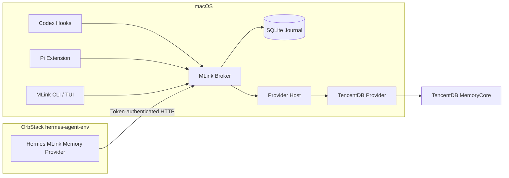

# MLink 用户层安装、适配器与 Journal 设计规格

状态：已确认，待实施计划  
日期：2026-08-28  
依赖规格：

- `2026-08-28-mlink-mvp-design.md`
- `2026-08-28-mlink-provider-host-design.md`

## 1. 目标

本规格只覆盖已经完成的 Provider Host 与 TencentDB Provider 之上的用户层垂直切片：

1. `mlink install` 安装引导。
2. TUI 选择 TencentDB MemoryCore 与 Codex、Pi、Hermes。
3. 通过 Agent 官方扩展面自动安装 Hook、Extension 或 Memory Provider 配置。
4. 配置预览、备份、恢复和卸载。
5. 使用 SQLite Journal 对完整回合做持久化入队、事件级防重复、有限重试和审计。
6. 在隔离环境验收后，先展示当前机器的真实 ChangeSet；得到用户确认后，再安装到本机 Codex、Pi 与 OrbStack `hermes-agent-env`。

## 2. 非目标

本轮不实现：

- Mem0 或其他第二个真实 Provider。
- Homebrew、npm/npx、PyPI 或签名 Release 分发。
- Web 管理界面。
- HyMemory 记忆迁移。
- Provider 之间的自动迁移、双写或回填。
- MLink 自己的语义去重、事实合并、冲突消解或时效排序。
- 将 MCP 作为自动记忆生效的必需链路。

## 3. 已确认的实现选择

采用统一 Broker + SQLite Journal + 三个薄 Agent Adapter：



不采用以下方案：

- 三个 Adapter 分别直连 TencentDB：会复制身份、重试、去重和 Provider 路由逻辑。
- MCP-first：MCP 适合显式维护工具，不能代替三个 Agent 的完整自动生命周期。

Broker 是该切片不可省略的公共胶水，不是第二个记忆后端。它只负责规范化事件、身份授权、路由、预算和可靠传输。

## 4. 安装事务

### 4.1 不可绕过的顺序

每次安装或重配置必须经过：

```text
detect
  → plan
  → render diff
  → explicit confirmation
  → backup
  → apply
  → semantic verify
  → runtime verify
  → commit manifest
```

执行安装前不允许修改任何 Agent 配置。`mlink install --dry-run` 和 TUI 的“预览变更”使用同一个 ChangeSet，不维护两套逻辑。

任一关键步骤失败时，Installer 按已应用操作的相反顺序回滚。回滚失败必须保留备份和部分安装清单，并将状态标为 `rollback_required`，不能声称安装成功。

### 4.2 ChangeSet

ChangeSet 至少包含：

```text
ChangeSet
  plan_id
  generated_at
  mlink_version
  detected_agents[]
  selected_connection
  operations[]
  protected_invariants[]
  warnings[]

Operation
  operation_id
  target
  action: create | semantic_merge | remove_owned | service_action
  owner_id
  before_hash
  proposed_hash
  semantic_diff
  rollback_action
```

预览必须显示实际绝对路径，以及每个目标的“新增、修改、不变、冲突”。Secret 只显示引用与是否变化，不显示明文。

### 4.3 模型配置保护

Installer 对每个 Agent 建立受保护字段快照，并在写入后做语义比较。至少保护：

- 模型名与模型 Provider。
- LLM Base URL。
- API Key、Token、登录与订阅状态引用。
- 与模型请求相关的环境变量和配置节点。

任何受保护字段发生计划外变化，都必须立即回滚。MLink 不代理 Agent 的 LLM 请求，也不读取、复制或迁移 Agent 的模型凭据。

## 5. MLink 本地布局

首版安装到当前 macOS 用户，不要求 root：

```text
~/.local/bin/mlink
~/Library/LaunchAgents/dev.mlink.broker.plist
~/.mlink/
  config.yaml
  state.db
  adapters/
  providers/
  backups/
  logs/
  run/mlink.sock
```

- 状态目录、Socket、备份、日志和 Token 配置仅当前用户可读写。
- Broker 作为用户级 LaunchAgent 运行。
- 当前开发阶段把已验证的构建复制到固定路径；运行时不依赖项目工作区。
- 本轮不宣称该开发构建已经签名或具备互联网分发条件。

## 6. CLI 与 TUI

### 6.1 公共命令

```text
mlink
mlink install [codex] [pi] [hermes]
mlink install --dry-run [--json]
mlink status [--json]
mlink doctor [codex|pi|hermes] [--json]
mlink config diff [--json]
mlink backup list [--json]
mlink backup create
mlink backup restore <backup-id> --dry-run
mlink backup restore <backup-id>
mlink uninstall [codex] [pi] [hermes]
```

内部生命周期命令不作为首版稳定公共 API：

```text
mlink broker serve
mlink provider run tencentdb
mlink hook codex <event>
```

### 6.2 首次向导

TUI 使用同一个应用服务执行九步引导：

1. 欢迎。
2. 只读环境检测。
3. 选择已安装 Provider；本轮只有 TencentDB。
4. 选择并验证 Memory Connection。
5. 配置身份和共享作用域。
6. 多选 Codex、Pi、Hermes。
7. 展示完整 ChangeSet 与受保护字段检查。
8. 用户确认后执行安装。
9. 逐 Agent 验证并进入状态仪表盘。

TUI 继续使用已确认的 MLink 像素字标与终端网格布局。像素字只用于品牌标题；正文按终端显示宽度计算，不能用字符串长度或手工空格对齐。窄终端切换到单列文本模式。

## 7. Codex Adapter

### 7.1 官方接入面

使用用户级 `~/.codex/hooks.json`，不修改 `~/.codex/config.toml`：

| Event | MLink 行为 |
|---|---|
| `SessionStart` | 在 `startup/resume/compact` 时召回有界共享上下文 |
| `UserPromptSubmit` | 用官方 `turn_id` 保存用户片段、执行在线召回并返回 `additionalContext` |
| `Stop` | 用同一 `turn_id` 和 `last_assistant_message` 完成回合并入队 |
| `SessionEnd` | 请求有限时长 flush，不把它当成可靠写入的唯一触发点 |

Hook 只调用固定绝对路径下的 MLink 二进制。它不解析 `transcript_path`，因为官方明确说明 transcript 格式不是稳定接口。

### 7.2 合并与所有权

- 若 `~/.codex/hooks.json` 不存在，创建仅含 MLink Hook 的文件。
- 若已存在，保留未知字段和所有非 MLink Hook，按事件数组做语义合并。
- MLink Hook 通过规范化的命令、事件和安装清单中的 semantic fingerprint 识别。
- 同一 fingerprint 重复安装不增加第二份 Hook。
- 用户修改 MLink Hook 后，更新或卸载进入冲突状态，不覆盖整个文件。

### 7.3 信任限制

Codex 官方要求非托管 Hook 按内容哈希进行用户信任。Installer 不使用 `--dangerously-bypass-hook-trust`，也不修改信任数据库。

状态机为：

```text
not_installed → installed → awaiting_trust → active
```

TUI 安装后要求用户在 Codex `/hooks` 中检查并信任；Doctor 只有观察到 Hook 实际运行后才标记 `active`。Hook 内容升级导致重新信任时，状态退回 `awaiting_trust`。

## 8. Pi Adapter

安装受 MLink 管理的用户级 Extension：

```text
~/.pi/agent/extensions/mlink.ts
```

| Pi event | MLink 行为 |
|---|---|
| `session_start` | 建立或恢复稳定 `session_id` |
| `before_agent_start` | 调用 Broker recall 并注入有界上下文 |
| `agent_end` | 更新当前低层运行的候选完成消息，不立即写入 |
| `agent_settled` | 在自动重试、压缩重试和后续运行全部结束后，提交最终 Turn |
| `session_shutdown` | 请求有限时长 flush |

Extension 只实现 Pi 事件与 Broker API 的映射，不加载 Provider SDK，不读取 Pi 模型配置。Pi 官方明确说明 `agent_end` 之后仍可能自动重试、压缩重试或继续处理后续消息，因此 Extension 只缓存最后一次候选结果，并在 `agent_settled` 到达时提交一次最终回合。Broker 仍使用 turn identity 与内容哈希作为最终幂等边界，不能把任何前端事件的触发次数当作幂等保证。

若目标文件已经存在且不属于当前 MLink 安装，Installer 必须报冲突，不能覆盖。

## 9. Hermes Adapter

### 9.1 官方 Provider 插件

MLink 作为用户级 Hermes Memory Provider 安装到实际活动配置的：

```text
$HERMES_HOME/plugins/mlink/
```

实现官方生命周期：

- `initialize(session_id, **kwargs)`：读取 `hermes_home`、`platform`、`user_id`、`user_id_alt` 等官方运行时字段。
- `prefetch(query, session_id=...)`：调用 Broker recall，超时返回空上下文。
- `sync_turn(user, assistant, session_id=..., messages=...)`：只做快速提交，不能阻塞 Hermes 回合。
- `shutdown()`：有限等待本地请求，不无限阻塞退出。

Hermes 配置中的 `memory.provider` 改为 `mlink`。Hermes 只允许一个外部 Provider，因此现有 HyMemory 会被停用但不会卸载或删除。

### 9.2 当前本机关闭内置记忆

用户已明确授权在当前本机关闭 Hermes 内置记忆。当前部署版本已验证支持官方配置开关，因此不修改 Hermes 源码：

```yaml
memory:
  memory_enabled: false
  user_profile_enabled: false
  provider: mlink
```

Installer 还要把 `memory` 合并进 `agent.disabled_toolsets`，避免仍向模型暴露内置 `memory` 工具。该设置同时会隐藏外部 Provider 的显式记忆工具；自动 `prefetch/sync_turn` 不受影响。本轮以自动召回与自动写入为目标，因此接受该限制。

现有 `MEMORY.md`、`USER.md` 及其内容不删除、不迁移、不清空。卸载或恢复时按安装前配置恢复三个配置节点；只有 MLink 自己添加的 `disabled_toolsets` 元素才会移除。

该行为必须满足：

- 只应用于用户在 TUI 中明确选择的 Hermes 配置/Profile。
- Preview 单独显示“内置记忆注入关闭、用户画像关闭、内置记忆工具关闭”。
- 若目标 Hermes 版本不认识这些官方字段，Installer 拒绝安装，不打源码补丁。
- 若配置写入后 Hermes status 与运行时探针不一致，立即回滚。

### 9.3 多用户身份

当前 Hermes 官方运行链路与 OrbStack 部署版本都已验证会把网关 `user_id/user_id_alt` 传给 Memory Provider 的 `initialize()`。

MLink Provider：

1. 优先使用稳定的 `user_id_alt`，否则使用 `user_id`。
2. 连同 `platform` 作为委托身份发送给 Broker。
3. Broker 使用 Keychain 中的身份密钥派生规范化 `user_id`。
4. 原始平台身份不发送给 TencentDB Provider，也不写入 Journal 正文或日志。

缺少稳定身份时，Hermes 长期记忆 recall/capture 必须返回 `identity_missing` 并 fail-open；不得回退到昵称、群 ID、静态 `default` 或上一个用户。

### 9.4 OrbStack 链路

Hermes 从 `hermes-agent-env` 通过 OrbStack 宿主机地址访问 Broker。使用独立、随机、逐 Adapter Bearer Token：

- Token 只授权 Hermes Adapter、选定 Connection 和委托身份来源。
- Token 文件在 OrbStack 中权限为 `0600`。
- Broker 不静默监听 `0.0.0.0`；只绑定 Doctor 验证过的 OrbStack 可达地址。
- Doctor 必须从 `hermes-agent-env` 内实测 DNS、TCP、认证与往返延迟。

## 10. Broker Adapter API

宿主机 Unix Domain Socket 和 OrbStack HTTP 共享版本化 API：

| Endpoint | 用途 |
|---|---|
| `GET /v1/health` | 最小健康状态 |
| `POST /v1/recall` | 有界在线召回 |
| `POST /v1/turn-fragments` | 保存用户或助手片段 |
| `POST /v1/turns` | 提交完整回合并返回本地队列回执 |
| `POST /v1/sessions/{session_id}/flush` | 有限时长刷新 |

固定身份 Adapter（Codex、Pi）不能覆盖自己的规范化用户、Agent 或 Connection。委托身份 Adapter（Hermes）只能提交 Token 授权的平台来源与稳定 subject，不能直接指定任意规范化 `user_id`。

Broker 不可用时 Adapter fail-open：不注入记忆、不阻止 Agent 回复。Adapter 不建立自己的第二套持久化队列，因此 Broker 接收到事件之前发生的故障可能导致该回合未捕获；这是避免多队列重复与隐私扩散的明确权衡。

## 11. SQLite Journal

### 11.1 职责

SQLite 只保存：

- 未完成的回合片段。
- 待发送完整回合。
- 幂等键、内容哈希、尝试次数和下次重试时间。
- Provider 回执、失败和 ambiguous 状态。
- 配置 revision、安装清单和备份索引。

SQLite 不保存正式长期记忆，不做 embedding、语义相似判断、事实覆盖或时效排序。

### 11.2 核心表

```text
schema_migrations
config_revisions
adapter_installations
owned_resources
backup_artifacts
turn_fragments
journal_events
delivery_attempts
```

Broker 是数据库唯一写者，启用 WAL。Adapter 只通过 Broker API 入队，不直接打开数据库。

### 11.3 回合与幂等

规范化幂等键由以下字段计算：

```text
connection_id
provider_id
provider_version
config_revision
tenant_id
agent_id
user_id
session_id
turn_id
content_hash
```

规则：

- 同一幂等键重复提交返回已有本地回执。
- 同一作用域和 `turn_id`、不同内容哈希进入 `conflict`，不覆盖旧事件。
- Fragment 乱序到达时可配对；缺失另一角色时保留到有限期限并由 Doctor 展示。
- Agent 生命周期事件触发次数不能被当作幂等保证。

### 11.4 状态机

```text
queued → dispatching → accepted → visible
                   ↘ retryable_failed
                   ↘ permanent_failed
                   ↘ ambiguous
```

- 只对 Provider 声明 `replay_safe=true` 的暂时失败自动重试。
- 请求已发送但回执未知，且 Provider 不能证明可安全重放时，进入 `ambiguous`。
- `ambiguous` 不自动重发，避免用“可能漏一次”换成确定的重复污染。
- Journal 保证 MLink 不重复调度已确认事件，不承诺后端不具备的 exactly-once。

### 11.5 正文保留

- Journal 文件权限仅当前用户可读写。
- 完成回合在 `queued/dispatching/retryable_failed/ambiguous` 期间需要保留正文，以支持交付或人工核对。
- Provider 到达最终成功状态后，清除用户和助手正文，只保留内容哈希、作用域哈希、回执、耗时与审计状态。
- 普通备份默认不包含待发送正文；若队列未排空，备份与卸载必须明确告警。
- 日志永不记录完整回合、召回正文、原始平台稳定 ID 或 Secret。

## 12. 备份、恢复与卸载

### 12.1 备份

每个被修改文件在写入前保存：

- 原文件副本。
- 原文件 SHA-256。
- 计划后 SHA-256。
- 语义快照。
- MLink owned resource fingerprint。
- MLink 与 Adapter 版本。

备份创建完成并通过哈希校验后才能写目标文件。

### 12.2 恢复

`mlink backup restore <id> --dry-run` 先显示恢复 ChangeSet。默认采用语义恢复：只恢复 MLink 拥有的节点与安装前值。

只有当前文件哈希仍等于 MLink 安装后的已知哈希时，才允许无冲突整文件恢复。用户后续修改过同一资源时，恢复停止并显示冲突，不静默覆盖。

### 12.3 卸载

卸载只删除或恢复：

- MLink Codex Hook 节点。
- MLink Pi Extension 文件。
- MLink Hermes Provider 目录、Token 与 Adapter 绑定。
- Hermes 安装前的 `memory.provider`、两个内置记忆开关和 MLink 添加的 `disabled_toolsets` 元素。
- MLink LaunchAgent、Socket 和用户选择删除的本地状态。

卸载不删除：

- Agent、本身会话、模型、账号或订阅。
- `MEMORY.md`、`USER.md`、HyMemory 包或 HyMemory 后端数据。
- TencentDB MemoryCore 或其中记忆。
- 用户安装后新增的其他配置。

存在 queued、ambiguous 或 permanent failure 事件时，默认阻止删除 Journal，并提供排空、导出审计包或明确放弃三种选择。

## 13. 错误与降级

- Recall 有硬超时，失败返回空上下文。
- Capture 进入本地队列后立即返回，不占用 Agent 在线响应路径。
- Provider Host 崩溃使用有限退避并熔断；Agent 继续无外部记忆运行。
- 配置冲突、Hook 未信任、Hermes 身份缺失和 OrbStack 不可达必须是独立状态，不能统一显示为 `healthy=false`。
- Agent 版本低于已验证接口时拒绝安装，不猜测兼容。

## 14. 已知产品限制

1. MLink 防止同一事件因重放或重试重复写入，但不解决不同回合的语义重复。
2. 过期库存、新旧事实冲突和画像合并仍由 TencentDB MemoryCore 负责。
3. 后端不提供幂等保证时，网络回执丢失只能进入 ambiguous，不能承诺 exactly-once。
4. Codex Hook 信任需要用户在 `/hooks` 中完成，因此不是完全无交互安装。
5. Hermes 关闭内置 `memory` 工具后，首版不提供 Hermes 内的显式记忆维护工具；自动召回和写入仍有效。
6. Broker 接收事件前若不可用，该回合可能不会被捕获；Adapter 不建立第二套持久化队列。
7. 当前开发构建未包含正式分发、签名和自动升级能力。

## 15. 测试策略

### 15.1 单元与 Golden 测试

- Codex `hooks.json` 新建、语义合并、重复安装、冲突和卸载。
- Pi Extension 安装、文件冲突、`agent_end → agent_settled` 最终化和事件 payload。
- Hermes YAML 合并、关闭内置记忆、恢复旧 Provider 与工具集。
- 模型配置保护字段安装前后完全一致。
- ChangeSet 文本、JSON 和 TUI 模型使用相同数据。
- Journal 状态迁移、重复、内容冲突、乱序 Fragment、重试和 ambiguous。

### 15.2 隔离集成测试

- 使用临时 HOME 和假的 Agent 配置，不触碰真实用户文件。
- 使用测试 Broker、假的 OrbStack 执行器和已完成的 Provider Host 测试 Provider。
- 覆盖安装中途失败与每一步反向回滚。
- 覆盖安装 → 用户修改无关配置 → 卸载的往返行为。
- `go test -race ./...` 验证并发 Hook 与 Journal 单写边界。

### 15.3 当前机器预览

隔离验收通过后，针对当前机器生成只读真实 ChangeSet。预览必须包含：

- Codex、Pi、Hermes 的实际路径和版本。
- 当前 Hermes Provider 到 `mlink` 的切换。
- Hermes 三个内置记忆相关配置变化。
- 新增 LaunchAgent、Socket、Provider 与 Adapter 文件。
- 所有模型、Base URL、认证与订阅字段均未变化的检查结果。

用户确认真实 ChangeSet 后才能应用。

### 15.4 实机验收

- Broker LaunchAgent、Socket 和 Provider Host 健康。
- Codex Hook 已安装；在用户完成 `/hooks` 信任后观察实际 Hook 调用。
- Pi Extension 在真实 Pi 会话执行 recall/capture。
- Hermes 从 `hermes-agent-env` 实测宿主机地址、Token、prefetch 和非阻塞 sync。
- Hermes 运行时确认内置 MEMORY/USER 注入和内置 memory 工具均关闭。
- 使用两个飞书稳定用户做交错隔离测试。
- 测试写入只使用专用测试作用域；真实后端写入和清理范围在执行前单独展示。

### 15.5 最终对抗性测试

至少覆盖：

- 同一 Codex/Pi/Hermes 回合重放十次。
- Fragment 乱序、缺失 Stop、重复 agent_end、缺失或重复 agent_settled。
- 同一 `turn_id` 不同内容冲突。
- 两个飞书用户 100 次交错读写不串数据。
- 身份缺失、昵称变化与同名不同 ID。
- Provider 延迟、断连、坏帧、崩溃和回执丢失。
- Broker 重启和 macOS LaunchAgent 重启。
- OrbStack Token 伪造身份或 Connection。
- 记忆中包含伪系统指令。
- 重复事实与过期库存测试明确区分 MLink 事件级结果和 TencentDB 语义结果。

## 16. 完成标准

本切片只有同时满足以下条件才算完成：

1. `mlink install` 与 TUI 能从空状态完成选择、预览、安装和逐项验证。
2. 未经用户确认，当前 Agent 配置没有任何写入。
3. Codex、Pi、Hermes 三个 Adapter 通过隔离测试和真实运行验证。
4. Hermes 使用 MLink 作为唯一外部 Provider，且当前本机内置记忆注入、用户画像和内置 memory 工具均已关闭。
5. SQLite Journal 的重复、冲突、重试、ambiguous 与正文清理行为通过测试。
6. 模型地址、模型 Provider、认证和订阅配置保护测试通过。
7. 备份、恢复、卸载和失败回滚往返测试通过。
8. 最终对抗性测试报告明确区分 MLink 缺陷与 TencentDB Provider/MemoryCore 能力限制。
